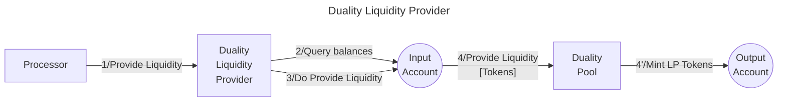

# Duality Lper library

The **Valence Duality LPer library** allows users to **provide liquidity** into a Duality Liquidity Pool from an **input account** and deposit the LP token into an **output account**.

## High-level flow


## Functions

| Function    | Parameters | Description |
|-------------|------------|-------------|
| **ProvideLiquidity** | -          | Provide double-sided liquidity to the pre-configured **Duality Pool** from the **input account**, and deposit the **LP tokens** into the **output account**. |

## Configuration

The library is configured on instantiation via the `LibraryConfig` type.

```rust
pub struct LibraryConfig {
    /// Address of the input account 
    pub input_addr: LibraryAccountType,
    /// Address of the output account 
    pub output_addr: LibraryAccountType,
    /// Configuration for the liquidity provider
    /// This includes the pool address and asset data
    pub lp_config: LiquidityProviderConfig,
}

pub struct LiquidityProviderConfig {
    /// Address of the pool we are going to provide liquidity for
    pub pool_addr: String,
    /// Denoms of both assets we are going to provide liquidity for
    pub asset_data: AssetData,
}
```

## Implementation Details

### Deposit Process

1. **Balance Check**: Queries the input account balance for the specified pool assets.
2. **Provide Liquidity**: Executes a `Deposit` message, which provides liquidity to the pool. Upon depositing, the provider obtains an amount of LP token shares.
3. **Reply Handling**: Uses the CosmWasm reply mechanism to handle the two-step process of providing liquidity. Upon successful deposit, the obtained LP token shares will be transferred to the Valence output account, which will hold the position.

### Error Handling

- **No Funds**: Returns an error if attempting to deposit with a zero balance of pool assets.
- **Duality Integration**: Propagates errors from the Duality Protocol during deposit operations.

