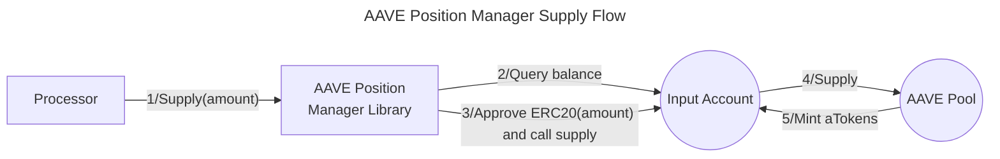
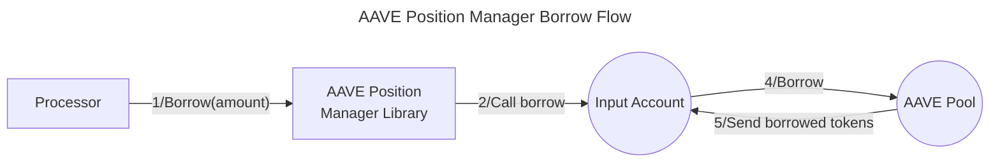
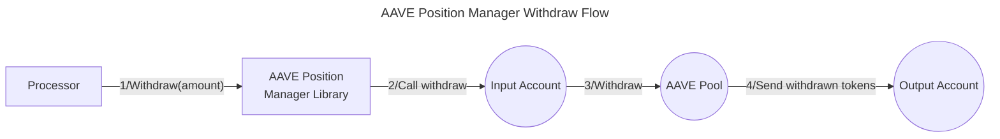
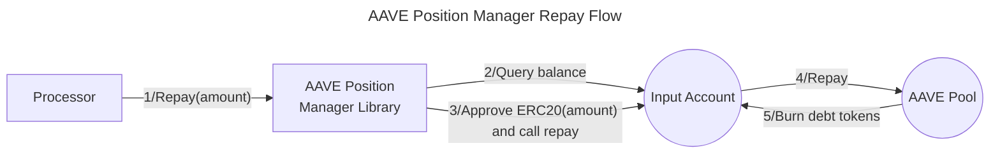
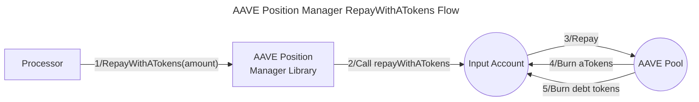

# Valence AAVE Position Manager library

The **Valence AAVE Position Manager** library allows **management of lending positions** using an **input account** and an **output account** using the [AAVE v3 Protocol](https://aave.com/docs/developers/aave-v3). It is typically used as part of a **Valence Program**. In that context, a **Processor** contract will be the main contract interacting with the AAVE Position Manager library.

## High-level flows











## Functions

| Function             | Parameters | Description                                                                                                                                                                                 |
| -------------------- | ---------- | ------------------------------------------------------------------------------------------------------------------------------------------------------------------------------------------- |
| **supply**           | amount     | Supplies tokens from the **input account** to the AAVE protocol. The **input account** will receive these corresponding aTokens. If amount is 0, the entire balance will be used.            |
| **borrow**           | amount     | Borrows tokens from the AAVE protocol using the collateral previously supplied. The **input account** will receive the borrowed tokens and the debt tokens. |
| **withdraw**         | amount     | Withdraws previously supplied tokens from AAVE and sends them to the **output account**. Passing 0 will withdraw the entire balance.                                              |
| **repay**            | amount     | Repays borrowed tokens to the AAVE protocol from the **input account**. If amount is 0, repays the entire balance.                                                                          |
| **repayWithATokens** | amount     | Repays borrowed tokens using aTokens directly, which can be more gas-efficient. Passing 0 repay as much as possible.                                                         |

More details on how the interaction with the AAVE v3 protocol works can be found in the [AAVE V3 Pool documentation](https://aave.com/docs/developers/smart-contracts/pool).

## Configuration

The library is configured on deployment using the `AavePositionManagerConfig` type.

```solidity
    /**
     * @title AavePositionManagerConfig
     * @notice Configuration struct for Aave lending operations
     * @dev Used to define parameters for interacting with Aave V3 protocol
     * @param poolAddress The address of the Aave V3 Pool contract
     * @param inputAccount The account from which transactions will be initiated
     * @param outputAccount The account that will receive withdrawals. Can be the same as inputAccount.
     * @param supplyAsset Address of the token to supply to Aave
     * @param borrowAsset Address of the token to borrow from Aave
     * @param referralCode Referral code for Aave protocol (if applicable - 0 if the action is executed directly by the user, without any middle-men)
     */
    struct AavePositionManagerConfig {
        IPool poolAddress;
        Account inputAccount;
        Account outputAccount;
        address supplyAsset;
        address borrowAsset;
        uint16 referralCode;
    }
```
