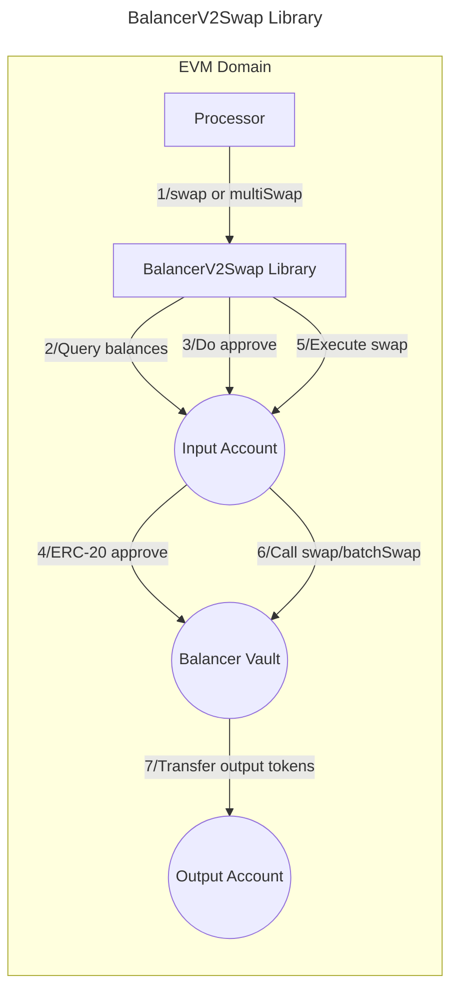

# Valence BalancerV2Swap Library

The **Valence BalancerV2Swap** library enables **token swaps** from an **input account** to an **output account** using the [Balancer V2 protocol](https://docs-v2.balancer.fi/). It is typically used as part of a **Valence Program**. In that context, a **Processor** contract will be the main contract interacting with the BalancerV2Swap library.

## High-level flow



## Functions

| Function      | Parameters                                                           | Description                                                  |
| ------------- | -------------------------------------------------------------------- | ------------------------------------------------------------ |
| **swap**      | poolId, tokenIn, tokenOut, userData, amountIn, minAmountOut, timeout | Execute a single token swap through a Balancer V2 pool.      |
| **multiSwap** | poolIds, tokens, userDataArray, amountIn, minAmountOut, timeout      | Execute a multi-hop swap through multiple Balancer V2 pools. |

## Single Swap Parameters

The `swap` function requires the following parameters:

| Parameter        | Type    | Description                                                                                          |
| ---------------- | ------- | ---------------------------------------------------------------------------------------------------- |
| **poolId**       | bytes32 | The ID of the Balancer pool to use for the swap                                                      |
| **tokenIn**      | address | Address of the token to swap from                                                                    |
| **tokenOut**     | address | Address of the token to swap to                                                                      |
| **userData**     | bytes   | Additional data for specialized pools (usually empty bytes)                                          |
| **amountIn**     | uint256 | Amount of tokens to swap. If set to 0, all available tokens in the **input_account** will be swapped |
| **minAmountOut** | uint256 | Minimum amount of output tokens to receive (slippage protection)                                     |
| **timeout**      | uint256 | How long the transaction is valid for (in seconds)                                                   |

## Multi-Hop Swap Parameters

The `multiSwap` function enables complex trading routes through multiple pools:

| Parameter         | Type      | Description                                                                                                                                                                                                    |
| ----------------- | --------- | -------------------------------------------------------------------------------------------------------------------------------------------------------------------------------------------------------------- |
| **poolIds**       | bytes32[] | Array of pool IDs to use for each swap step (in sequence)                                                                                                                                                      |
| **tokens**        | address[] | Array of all token addresses involved in the swap path (in sequence), needs to contain exactly 1 more element than the poolIds array                                                                           |
| **userDataArray** | bytes[]   | Additional data for specialized pools (one entry per pool). This data can be empty for all current Balancer pools but is reserved for possible future pool logic. Must be the same length as the poolIds array |
| **amountIn**      | uint256   | Amount of tokens to swap. If set to 0, all available tokens in the **input_account** will be swapped                                                                                                           |
| **minAmountOut**  | uint256   | Minimum amount of output tokens to receive (slippage protection)                                                                                                                                               |
| **timeout**       | uint256   | How long the transaction is valid for (in seconds)                                                                                                                                                             |

For more information on how swaps work on Balancer V2, please refer to the [Single Swap](https://docs-v2.balancer.fi/reference/swaps/single-swap.html) and [Batch Swap](https://docs-v2.balancer.fi/reference/swaps/batch-swaps.html) documentation.

## Configuration

The library is configured on deployment using the `BalancerV2SwapConfig` type.

```solidity
/**
 * @title BalancerV2SwapConfig
 * @notice Configuration for Balancer V2 swaps
 * @param inputAccount The account from which tokens will be taken
 * @param outputAccount The account to which result tokens will be sent
 * @param vaultAddress Address of the Balancer V2 Vault
 */
struct BalancerV2SwapConfig {
    BaseAccount inputAccount;
    BaseAccount outputAccount;
    address vaultAddress;
}
```
