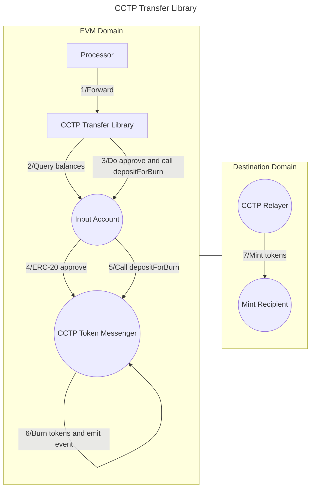

# Valence CCTP Transfer library

The **Valence CCTP Transfer** library allows to **transfer funds** from an **input account** to a **mint recipient** using the [Cross-Chain Transfer Protocol (CCTP) v1](https://developers.circle.com/stablecoins/cctp-getting-started). It is typically used as part of a **Valence Program**. In that context, a **Processor** contract will be the main contract interacting with the CCTP Transfer library.

## High-level flow



## Functions

| Function     | Parameters | Description                                                                                                   |
| ------------ | ---------- | ------------------------------------------------------------------------------------------------------------- |
| **Transfer** | -          | Transfer funds from the configured **input account** to the **mint recipient** on the **destination domain**. |

## Configuration

The library is configured on deployment using the `CCTPTransferConfig` type.

```solidity
    /**
     * @dev Configuration struct for token transfer parameters.
     * @param amountToTransfer The number of tokens to transfer. If set to 0, the entire balance is transferred.
     * @param mintRecipient The recipient address (in bytes32 format) on the destination chain where tokens will be minted.
     * @param inputAccount The account from which tokens will be debited.
     * @param destinationDomain The domain identifier for the destination chain.
     * @param cctpTokenMessenger The CCTP Token Messenger contract.
     * @param transferToken The ERC20 token address that will be transferred.
     */
    struct CCTPTransferConfig {
        uint256 amountToTransfer; // If we want to transfer all tokens, we can set this to 0.
        bytes32 mintRecipient;
        Account inputAccount;
        uint32 destinationDomain;
        ITokenMessenger cctpTokenMessenger;
        address transferToken;
    }
```
