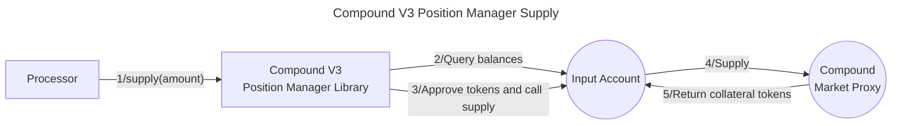
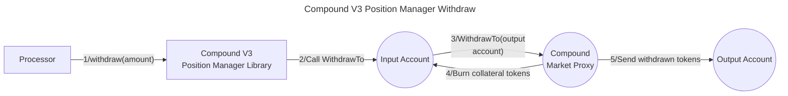
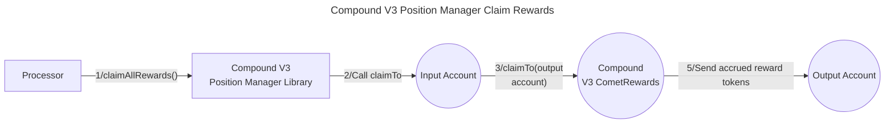

# Valence Compound V3 Position Manager library

The **Valence Compound V3 Position Manager** library allows **management of liquidity positions** using an **input account** and an **output account** through the [Compound V3 Protocol](https://docs.compound.finance/). It is typically used as part of a **Valence Program**. In that context, a **Processor** contract will be the main contract interacting with the Compound V3 Position Manager library.

## High-level flows







## Functions

| Function               | Parameters    | Description                                                                                                                                                                                      |
| ---------------------- | ------------- | ------------------------------------------------------------------------------------------------------------------------------------------------------------------------------------------------ |
| **supply**             | amount        | Supplies tokens from the **input account** to the Compound V3 protocol. The **input account** will receive the corresponding collateral tokens. If amount is 0 the entire balance will be used.  |
| **withdraw**           | amount        | Withdraws previously supplied tokens from Compound V3 and sends them to the **output account**. Passing 0 will withdraw the entire balance.                                                      |
| **supplyCollateral**   | asset, amount | Supplies the token specified in **asset**. Works the same way as **supply** but instead of supplying the token specified in the library config, it supplies the token passed as a parameter      |
| **withdrawCollateral** | asset, amount | Withdraw the token specified in **asset**. Works the same way as **withdraw** but instead of withdrawing the token specified in the library config, it withdraws the token passed as a parameter |
| **getRewardOwed** | | Returns the rewards accrued but not yet claimed for the position
| **claimAllRewards** | | Claims the reward accrued by the position to position's output account

## Configuration

The library is configured on deployment using the `CompoundV3PositionManagerConfig` type.

```solidity
    /**
     * @title CompoundV3PositionManagerConfig
     * @notice Configuration struct for CompoundV3 lending operations
     * @dev Used to define parameters for interacting with CompoundV3 protocol
     * @param inputAccount The Base Account from which transactions will be initiated
     * @param outputAccount The Base Account that will receive withdrawals.
     * @param baseAsset Address of the base token of the CompoundV3 market
     * @param marketProxyAddress Address of the CompoundV3 market proxy
     * @param rewards Address of the CompoundV3 CometRewards contract
     */
    struct CompoundV3PositionManagerConfig {
        BaseAccount inputAccount;
        BaseAccount outputAccount;
        address baseAsset;
        address marketProxyAddress;
        address rewards;
    }
```

## Acknowledgments

Thanks to Mujtaba, Hareem, and Ayush from [Orbit](https://www.orbitearn.com/) for this contribution.
