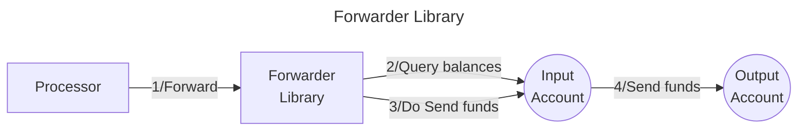

# Valence Forwarder Library

The **Valence Forwarder** library allows to **continuously forward funds** from an **input account** to an **output account**, following some time **constraints**. It is typically used as part of a **Valence Program**. In that context, a **Processor** contract will be the main contract interacting with the Forwarder library.

## High-level flow



## Functions

| Function    | Parameters | Description                                                                                                                                |
| ----------- | ---------- | ------------------------------------------------------------------------------------------------------------------------------------------ |
| **Forward** | -          | Forward funds from the configured **input account** to the **output account**, according to the **forwarding configs** & **min interval**. |

## Configuration

The library is configured on deployment using the `ForwarderConfig` type.

```solidity
    /**
     * @dev Configuration for a single token forwarding rule
     * @param tokenAddress Address of token to forward (0x0 for native coin)
     * @param maxAmount Maximum amount to forward per execution
     */
    struct ForwardingConfig {
        address tokenAddress;
        uint256 maxAmount;
    }

    /**
     * @dev Interval type for forwarding: time-based or block-based
     */
    enum IntervalType {
        TIME,
        BLOCKS
    }

    /**
     * @dev Main configuration struct
     * @param inputAccount Source account
     * @param outputAccount Destination account
     * @param forwardingConfigs Array of token forwarding rules
     * @param intervalType Whether to use time or block intervals
     * @param minInterval Minimum interval between forwards
     */
    struct ForwarderConfig {
        Account inputAccount;
        Account outputAccount;
        ForwardingConfig[] forwardingConfigs;
        IntervalType intervalType;
        uint64 minInterval;
    }

    /**
     * @dev Tracks last execution time/block
     */
    struct LastExecution {
        uint64 blockHeight;
        uint64 timestamp;
    }
```
