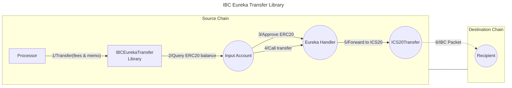

# IBC Eureka Transfer Library

The IBC Eureka Transfer library enables transferring ERC20 tokens from an **input account** on an EVM chain to a **recipient** on an IBC Eureka connected chain using the IBC protocol via [IBC Eureka's Solidity implementation](https://docs.skip.build/go/eureka/eureka-overview). This library also takes advantage of [Skip Go API](https://docs.skip.build/go/general/getting-started) that provides an `EurekaHandler` wrapper and the relaying service for the underlying protocol. It is typically used as part of a **Valence Program**. In that context, a **Processor** contract will be the main contract interacting with the IBC Eureka Transfer library.

## High-level flow



## Functions

| Function     | Parameters                                                    | Description                                                                                                                                                                                                                                                                                     |
| ------------ | ------------------------------------------------------------- | ----------------------------------------------------------------------------------------------------------------------------------------------------------------------------------------------------------------------------------------------------------------------------------------------- |
| **Transfer** | `fees`: Relay fee structure<br>`memo`: Additional information | Transfer tokens from the configured **input account** to the **recipient** on the destination IBC chain. The `fees` parameter specifies relay fees, fee recipient, and quote expiry. The `memo` parameter can contain additional information that might execute logic on the destination chain. |

## Configuration

The library is configured on deployment using the `IBCEurekaTransferConfig` type.

```solidity
/**
 * @dev Configuration struct for token transfer parameters.
 * @param amount The number of tokens to transfer. If set to 0, the entire balance is transferred.
 * @param transferToken The ERC20 token address that will be transferred.
 * @param inputAccount The account from which tokens will be debited.
 * @param recipient The recipient address on the destination IBC chain (in bech32 format).
 * @param sourceClient The source client identifier (e.g. cosmoshub-0).
 * @param timeout The timeout for the IBC transfer in seconds. Skip Go uses 12 hours (43200 seconds) as the default timeout.
 * @param eurekaHandler The EurekaHandler contract which is a wrapper around the ICS20Transfer contract.
 */
struct IBCEurekaTransferConfig {
    uint256 amount;
    address transferToken;
    BaseAccount inputAccount;
    string recipient;
    string sourceClient;
    uint64 timeout;
    IEurekaHandler eurekaHandler;
}
```

## Special Considerations

- The EurekaHandler contract on Ethereum that is used to transfer from Ethereum to CosmosHub is at `0xfc2d0487a0ae42ae7329a80dc269916a9184cf7c`.
- The recipient address is not in Bytes32 format but in the format used by the IBC chain (e.g., bech32: `cosmos1...`).
- To build the `Fees` structure for the transfer, we query the Skip Go API to obtain all the necessary information. Here is an example of a query:

```bash
curl -X POST "https://go.skip.build/api/skip/v2/fungible/route" \
  -H "Content-Type: application/json" \
  -d '{
    "source_asset_denom": "0xbf6Bc6782f7EB580312CC09B976e9329f3e027B3",
    "source_asset_chain_id": "1",
    "dest_asset_denom": "uatom",
    "dest_asset_chain_id": "cosmoshub-4",
    "amount_in": "20000000",
    "allow_multi_tx": true,
    "allow_unsafe": true,
    "go_fast": true,
    "smart_relay": true,
    "experimental_features": ["eureka"],
    "smart_swap_options": {
      "split_routes": true,
      "evm_swaps": true
    }
  }
```

This is a query to obtain the fee information for transferring 20 ATOM from Ethereum (chain ID `1`) to the Cosmos Hub (chain ID `cosmoshub-4`). This will return us a response from which we can extract the `smart_relay_fee_quote` information that contains all the information to build the `Fees` structure. Important: The `quoteExpiry` timestamp of the `Fees` is passed in seconds.

- The memo can be used to execute logic on the destination chain. For example, if we want to execute a hop on the destination chain, we can use the memo to specify the hop parameters. Here is an example of a memo:

`{"dest_callback":{"address":"cosmos198plfkpwzpxxrlpvprhfmdkcf3frpa7kvduq9cw8lh02mm327tgqhh3s55"},"wasm":{"contract":"cosmos1zvesudsdfxusz06jztpph4d3h5x6veglqsspxns2v2jqml9nhywshhfp5j","msg":{"action":{"action":{"ibc_transfer":{"ibc_info":{"memo":"","receiver":"elys1....","recover_address":"cosmos1...","source_channel":"channel-1266"}}},"exact_out":false,"timeout_timestamp":1744774447117660400}}}}`

For more details on how this memo works, please refer to the [IBC callback middleware](https://github.com/cosmos/ibc-go/blob/16f51eb5635bc16c6361c44f2a963f4736d1cf8b/docs/docs/04-middleware/01-callbacks/05-end-users.md) documentation.

The `dest_callback` field specifies the address of the contract that will be called on the destination chain. In this case, `cosmos198plfkpwzpxxrlpvprhfmdkcf3frpa7kvduq9cw8lh02mm327tgqhh3s55` is a contract deployed on the Cosmos Hub that can handle these callbacks. The contract `cosmos1zvesudsdfxusz06jztpph4d3h5x6veglqsspxns2v2jqml9nhywshhfp5j` is the contract deployed to trigger these additional actions. These 2 contracts can be reused for all memos.
In this particular case, the memo is used to trigger an additional IBC transfer on the destination chain, in this case from the Cosmos Hub to Elys. The receiver is the address specified in the `receiver` field and the `recover_address` is the address that will receive the tokens in case of a failure.

- The function will automatically deduct relay fees from the total amount being transferred.
- IBC transfers require specifying a timeout period, after which the transfer is considered failed if not completed.
