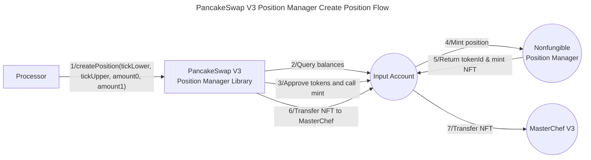
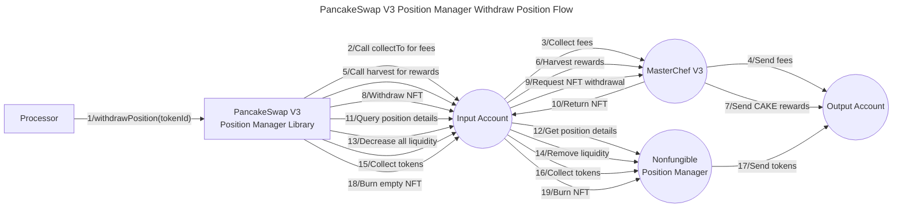

# Valence PancakeSwap V3 Position Manager library

The **Valence PancakeSwap V3 Position Manager** library allows **management of liquidity positions** using an **input account** and an **output account** through the [PancakeSwap V3 Protocol](https://docs.pancakeswap.finance/earn/pancakeswap-pools). It is typically used as part of a **Valence Program**. In that context, a **Processor** contract will be the main contract interacting with the PancakeSwap V3 Position Manager library.

## High-level flows





## Functions

| Function             | Parameters                             | Description                                                                                                                                                                                                                                                                                                      |
| -------------------- | -------------------------------------- | ---------------------------------------------------------------------------------------------------------------------------------------------------------------------------------------------------------------------------------------------------------------------------------------------------------------- |
| **createPosition**   | tickLower, tickUpper, amount0, amount1 | Creates a position on PancakeSwap V3 by providing liquidity in a specific price range and stakes it with the **input account** in MasterChef V3. If amount0 or amount1 is 0, the entire balance of that token will be used. Returns the tokenId of the created position.                                         |
| **withdrawPosition** | tokenId                                | Performs a complete withdrawal of a position: collects accumulated fees, harvests CAKE rewards, unstakes the NFT from MasterChef, removes all liquidity, and burns the NFT. Returns the amounts of fees collected, liquidity withdrawn, and rewards received and deposits all of them in the **output account**. |

## Configuration

The library is configured on deployment using the `PancakeSwapV3PositionManagerConfig` type.

```solidity
/**
 * @notice Configuration parameters for the PancakeSwapV3PositionManager
 * @param inputAccount Account used to provide liquidity and manage positions
 * @param outputAccount Account that receives withdrawn funds and rewards
 * @param positionManager Address of PancakeSwap's NonfungiblePositionManager contract
 * @param masterChef Address of PancakeSwap's MasterChefV3 for staking NFT positions and accrue CAKE rewards
 * @param token0 Address of the first token in the pair
 * @param token1 Address of the second token in the pair
 * @param poolFeeBps Fee tier of the liquidity pool (e.g., 500 = 0.05%)
 * @param timeout Maximum time for transactions to be valid
 * @param slippageBps Maximum allowed slippage in basis points (1 basis point = 0.01%)
 */
struct PancakeSwapV3PositionManagerConfig {
    BaseAccount inputAccount;
    BaseAccount outputAccount;
    address positionManager;
    address masterChef;
    address token0;
    address token1;
    uint24 poolFeeBps;
    uint16 slippageBps; // Basis points (e.g., 100 = 1%)
    uint256 timeout;
}
```
