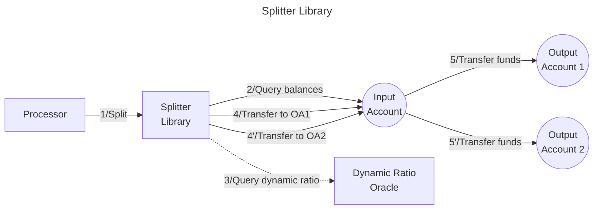

# Valence Splitter Library

The EVM Splitter library allows splitting funds from one input account to one or more output accounts, for one or more tokens according to the configured split configurations. Each token can be split using fixed amounts, fixed ratios, or dynamic ratios calculated by an external oracle contract. This library enables Valence Programs to distribute assets across multiple accounts with precise control over allocation strategies.

## High-level Flow



## Functions

| Function | Parameters | Description |
|----------|------------|-------------|
| **split** | - | Splits funds from the configured input account to the output accounts according to the configured split configurations for each token. |

## Configuration

The library is configured on deployment using the `SplitterConfig` type.

```solidity
    /**
     * @title SplitterConfig
     * @notice Configuration struct for splitting operations
     * @param inputAccount Address of the input account
     * @param splits Split configuration per token address
     */
    struct SplitterConfig {
        BaseAccount inputAccount;
        SplitConfig[] splits;
    }

    /**
     * @title SplitConfig
     * @notice Split config for specified account
     * @param outputAccount Address of the output account
     * @param token Address of the token account. Use address(0) to send ETH
     * @param splitType type of the split
     * @param splitData encoded configuration based on the type of split
     */
    struct SplitConfig {
        BaseAccount outputAccount;
        address token;
        SplitType splitType;
        bytes splitData;
    }

    /**
     * @title SplitType
     * @notice enum defining allowed variants of split config
     */
    enum SplitType {
        FixedAmount,    // Split a fixed amount of tokens
        FixedRatio,     // Split based on a fixed ratio (percentage)
        DynamicRatio    // Split based on a dynamic ratio from oracle
    }

    /**
     * @title DynamicRatioAmount
     * @notice Params for dynamic ratio split
     * @param contractAddress Address of the dynamic ratio oracle contract
     * @param params Encoded parameters for the oracle
     */
    struct DynamicRatioAmount {
        address contractAddress;
        bytes params;
    }
```

## Split Types

### Fixed Amount
Splits an exact number of tokens regardless of the total balance. The `splitData` contains the encoded amount as `uint256`.

### Fixed Ratio
Splits tokens based on a fixed percentage of the total balance. The `splitData` contains the encoded ratio as `uint256` scaled by 10^18.

### Dynamic Ratio
Splits tokens based on a ratio calculated by an external oracle contract. The `splitData` contains an encoded `DynamicRatioAmount` struct with the oracle contract address and parameters.

## Implementation Details

### Validation Rules

The library enforces several validation rules during configuration:

- **Input Account**: Must be a valid non-zero address
- **No Duplicates**: Cannot have duplicate splits for the same token and output account combination
- **Split Type Consistency**: Cannot mix different split types for the same token
- **Ratio Sum**: For fixed ratio splits, the sum of all ratios for a token must equal 1.0 (10^18)
- **Oracle Validation**: Dynamic ratio oracle addresses must be valid smart contracts

### Execution Process

1. **Balance Query**: Retrieves the current balance for each token from the input account
2. **Amount Calculation**: Calculates split amounts based on the configured split type:
   - **Fixed Amount**: Uses the configured amount directly
   - **Fixed Ratio**: Multiplies balance by ratio and divides by 10^18
   - **Dynamic Ratio**: Queries the oracle contract for the current ratio
3. **Transfer Execution**: Executes transfers from the input account to each output account

### Oracle Integration

For dynamic ratio splits, the library integrates with external oracle contracts implementing the `IDynamicRatioOracle` interface:

```solidity
interface IDynamicRatioOracle {
    function queryDynamicRatio(IERC20 token, bytes calldata params) 
        external view returns (uint256 ratio);
}
```

The oracle returns a ratio scaled by 10^18, which must not exceed 1.0 (10^18). This enables integration with price oracles, TWAP calculators, or other dynamic pricing mechanisms.

### Native Asset Support

The library supports both ERC20 tokens and native ETH:
- **ERC20 Tokens**: Use the token contract address
- **Native ETH**: Use `address(0)` as the token address

## Acknowledgments

Thanks to Mujtaba, Hareem, and Ayush from [Orbit](https://www.orbitearn.com/) for this contribution.