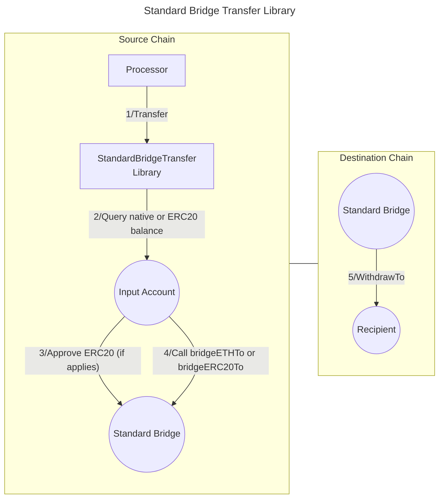

# Standard Bridge Transfer library

The **Standard Bridge Transfer** library allows to **transfer funds** from an **input account** to a **recipient** using a [Standard Bridge contract (both L1 and L2 variants)](https://docs.optimism.io/app-developers/bridging/standard-bridge). This bridge is used to transfer tokens between L1 and L2 EVM chains (e.g. Base to Ethereum and viceversa).It is typically used as part of a **Valence Program**. In that context, a **Processor** contract will be the main contract interacting with the Standard Bridge Transfer library.

## High-level flow



## Functions

| Function     | Parameters | Description                                                                                         |
| ------------ | ---------- | --------------------------------------------------------------------------------------------------- |
| **Transfer** | -          | Transfer funds from the configured **input account** to the **recipient** on the destination chain. |

## Configuration

The library is configured on deployment using the `StandardBridgeTransferConfig` type. More information on the config parameters can be found [here](https://docs.optimism.io/app-developers/bridging/standard-bridge).

```solidity
    /**
     * @dev Configuration struct for StandardBridge transfer parameters.
     * @param amount The number of tokens to transfer. If set to 0, the entire balance is transferred.
     * @param inputAccount The account from which tokens will be transferred from.
     * @param recipient The recipient address on the destination chain.
     * @param standardBridge The StandardBridge contract address (L1 or L2 version).
     * @param token The ERC20 token address to transfer (or address(0) for ETH).
     * @param remoteToken Address of the corresponding token on the destination chain (for ERC20).
     * @param minGasLimit Gas to use to complete the transfer on the receiving side. Used for sequencers/relayers.
     * @param extraData Additional data to be forwarded with the transaction.
     */
    struct StandardBridgeTransferConfig {
        uint256 amount;
        BaseAccount inputAccount;
        address recipient;
        IStandardBridge standardBridge;
        address token;
        address remoteToken;
        uint32 minGasLimit;
        bytes extraData;
    }
```
