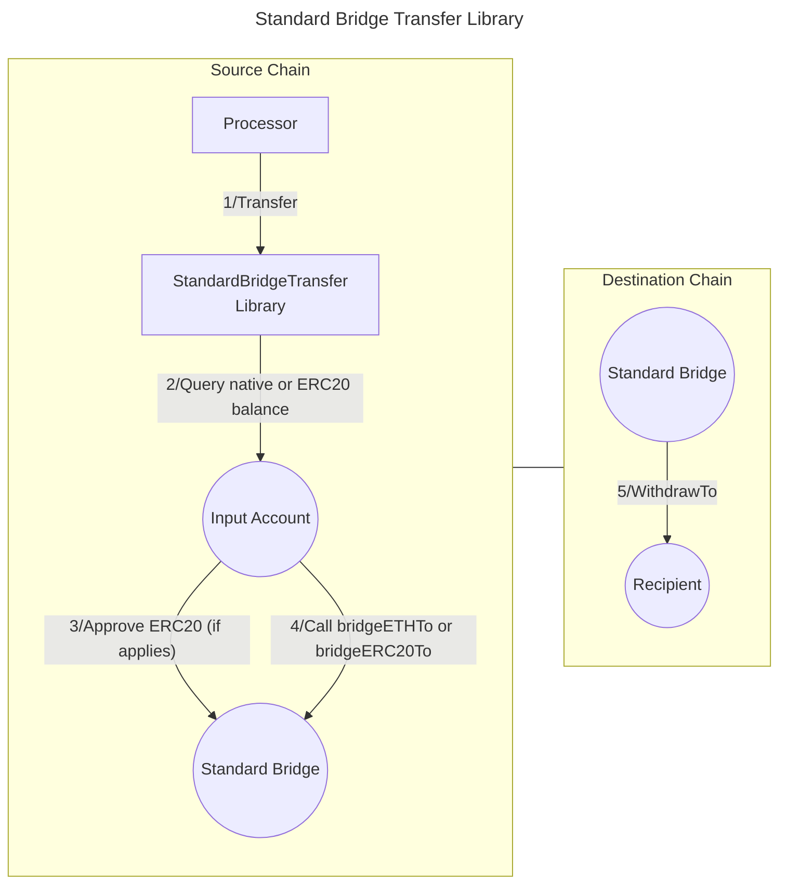

# Standard Bridge Transfer library

The Standard Bridge Transfer library enables transferring funds from an **input account** to a **recipient** using a [StandardBridge contract](https://docs.optimism.io/app-developers/bridging/standard-bridge). This library works with both the L1StandardBridge and L2StandardBridge implementations, allowing token transfers between Ethereum (Layer 1) and its scaling solutions like Optimism or Base (Layer 2). The library facilitates seamless bridging of assets in both directions - from L1 to L2 and from L2 to L1. It is typically used as part of a **Valence Program**. In that context, a **Processor** contract will be the main contract interacting with the Stargate Transfer library.

## High-level flow



## Functions

| Function     | Parameters | Description                                                                                         |
| ------------ | ---------- | --------------------------------------------------------------------------------------------------- |
| **Transfer** | -          | Transfer funds from the configured **input account** to the **recipient** on the destination chain. |

## Configuration

The library is configured on deployment using the `StandardBridgeTransferConfig` type. More information on the config parameters can be found [here](https://docs.optimism.io/app-developers/bridging/standard-bridge).

```solidity
    /**
     * @dev Configuration struct for StandardBridge transfer parameters.
     * @param amount The number of tokens to transfer. If set to 0, the entire balance is transferred.
     * @param inputAccount The account from which tokens will be transferred from.
     * @param recipient The recipient address on the destination chain.
     * @param standardBridge The StandardBridge contract address (L1 or L2 version).
     * @param token The ERC20 token address to transfer (or address(0) for ETH).
     * @param remoteToken Address of the corresponding token on the destination chain (for ERC20).
     * @param minGasLimit Gas to use to complete the transfer on the receiving side. Used for sequencers/relayers.
     * @param extraData Additional data to be forwarded with the transaction.
     */
    struct StandardBridgeTransferConfig {
        uint256 amount;
        BaseAccount inputAccount;
        address recipient;
        IStandardBridge standardBridge;
        address token;
        address remoteToken;
        uint32 minGasLimit;
        bytes extraData;
    }
```
