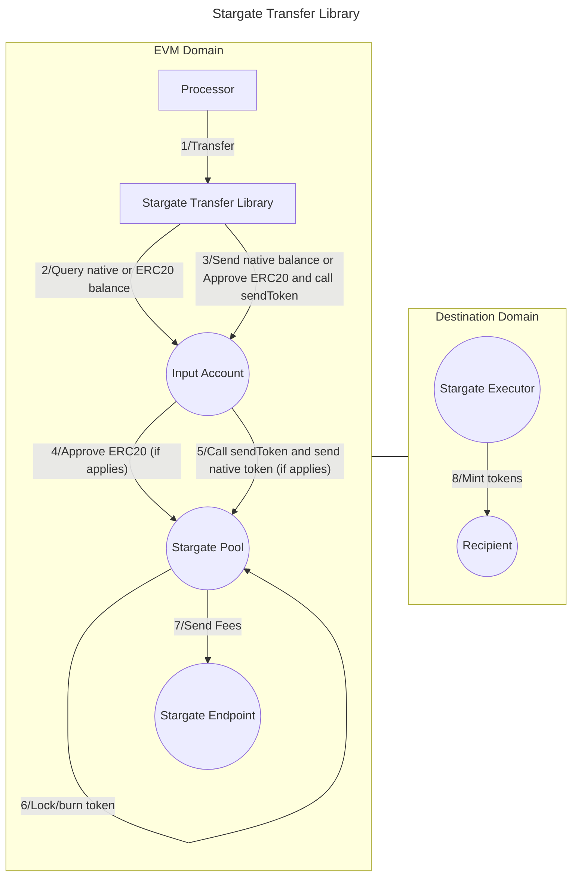

# Valence Stargate Transfer library

The **Valence Stargate Transfer** library allows to **transfer funds** from an **input account** to a **recipient** using the [Stargate Protocol v2](https://stargateprotocol.gitbook.io/stargate/v2-developer-docs) built on top of LayerZero v2. It is typically used as part of a **Valence Program**. In that context, a **Processor** contract will be the main contract interacting with the Stargate Transfer library.

## High-level flow



## Functions

| Function     | Parameters | Description                                                                                                   |
| ------------ | ---------- | ------------------------------------------------------------------------------------------------------------- |
| **Transfer** | -          | Transfer funds from the configured **input account** to the **recipient** on the **destination domain**. |

## Configuration

The library is configured on deployment using the `StargateTransferConfig` type. A list of supported Stargate destination domains that can be used in the `destinationDomain` field can be found [here](https://stargateprotocol.gitbook.io/stargate/v2-developer-docs/technical-reference/mainnet-contracts).

```solidity
    /**
     * @title StargateTransferConfig
     * @notice Configuration struct for cross-chain token transfers via Stargate Protocol
     * @dev Used to define parameters for LayerZero cross-chain messaging with Stargate
     * @param recipient The recipient address (in bytes32 format) on the destination chain
     * @param inputAccount The account from which tokens will be transferred
     * @param destinationDomain The destination chain endpoint ID. Find all IDs at https://stargateprotocol.gitbook.io/stargate/v2-developer-docs/technical-reference/mainnet-contracts
     * @param stargateAddress Stargate pool address implementing IOFT interface. See https://github.com/stargate-protocol/stargate-v2/blob/main/packages/stg-evm-v2/src/interfaces/IStargate.sol
     * @param transferToken Address of the token to transfer. If transferring native tokens, this will be the zero address (address(0))
     * @param amount Amount of tokens to transfer. If set to 0, all available tokens will be transferred
     * @param minAmountToReceive Minimum amount to receive on destination after fees. If set to 0, fees will be automatically calculated
     * @param refundAddress Address to refund tokens in case of failed transfer. If set to address(0), tokens will be refunded to the input account
     * @param extraOptions Additional options for the LayerZero message. Optional. See https://docs.layerzero.network/v2/developers/evm/protocol-gas-settings/options#option-types
     * @param composeMsg Message to execute logic on the destination chain. Optional. See https://docs.layerzero.network/v2/developers/evm/composer/overview#composing-an-oft--onft
     * @param oftCmd Indicates the transportation mode in Stargate. Empty bytes for "Taxi" mode, bytes(1) for "Bus" mode. See https://stargateprotocol.gitbook.io/stargate/v2-developer-docs/integrate-with-stargate/how-to-swap#sendparam.oftcmd
     */
    struct StargateTransferConfig {
        bytes32 recipient;
        Account inputAccount;
        uint32 destinationDomain;
        IStargate stargateAddress;
        address transferToken;
        uint256 amount;
        uint256 minAmountToReceive;
        address refundAddress;
        bytes extraOptions;
        bytes composeMsg;
        bytes oftCmd;
    }
```
