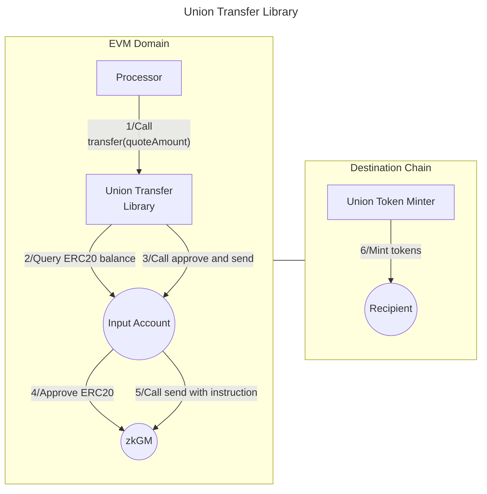

# Valence Union Transfer library

The **Valence Union Transfer** library allows to **transfer funds** from an **input account** to a **recipient** using the [Union UCS03-ZKGM protocol](https://docs.union.build/ucs/03/). It is typically used as part of a **Valence Program**. In that context, a **Processor** contract will be the main contract interacting with the Union Transfer library.

## High-level flow



## Functions

| Function     | Parameters  | Description                                                                                                                                                                                                                         |
| ------------ | ----------- | ----------------------------------------------------------------------------------------------------------------------------------------------------------------------------------------------------------------------------------- |
| **Transfer** | quoteAmount | Transfer funds from the configured **input account** to the **recipient** on the **destination chain**. The quoteAmount parameter can override the configured quote token amount. If 0 is passed, the amount in the config is used. |

## Configuration

The library is configured on deployment using the `UnionTransferConfig` type. A list of supported chains and their channels can be found [here](https://docs.union.build/protocol/chains/overview/). Additional information of parameters used in the configuration can be found [here](https://docs.union.build/ucs/03/)

All current deployed Union UCS03 contracts can be found in the [deployment section](https://docs.union.build/protocol/deployments/) under the name `ucs03`.

```solidity
    /**
     * @dev Configuration struct for Union transfer parameters.
     *
     * -- Transfer core parameters --
     * @param amount The number of tokens to transfer. If set to 0, the entire balance is transferred.
     * @param inputAccount The account from which tokens will be debited.
     * @param recipient The recipient (in Bytes format) on the destination chain where tokens will be received.
     *      For bech32 addresses, it just converts the entire address to bytes. For example the bytes representation
     *      of `bbn14mlpd48k5vkeset4x7f78myz3m47jcaxz9gpnl` would be
     *      `0x62626e31346d6c706434386b35766b657365743478376637386d797a336d34376a6361787a3967706e6c`
     *
     * -- Transfer token details --
     * @param transferToken The ERC20 token address that will be transferred.
     * @param transferTokenName The name of the token being transferred (e.g., "Babylon")
     * @param transferTokenSymbol The symbol of the token being transferred. (e.g., "BABY")
     * @param transferTokenDecimals The number of decimals for the token being transferred. (e.g., 6)
     * @param transferTokenUnwrappingPath Origin path for unwrapping, (e.g., 0 for WETH, 1 for BABY...). Related to the origin chain of these tokens.
     *
     * -- Quote token details --
     * @param quoteToken The token requested in return on destination chain. Bytes conversion of the token.
     *      For example, the quote Token for WETH on Babylon would be `0x62626e31333030736530767775653737686e36733877706836346579366435357a616634386a72766567397761667371756e636e33653473637373677664`
     *      which bytes conversion of "bbn1300se0vwue77hn6s8wph64ey6d55zaf48jrveg9wafsquncn3e4scssgvd" because WETH is a CW20 token on Babylon.
     *      For BABY, on the other side, it would be `0x7562626e` which is the bytes conversion of "ubbn".
     * @param quoteTokenAmount The amount of the quote token requested in return on the destination chain. If set to 0, the same amount as the transferred token is requested.
     *
     * -- Protocol parameters --
     * @param zkGM The zkGM contract.
     * @param protocolVersion The protocol version to be used. Required for backward compatibility. Allows dispatching between different versions.
     * @param channelId The channel ID for the transfer. This is used to identify the specific transfer channel.
     * @param timeout The timeout in seconds for the transfer. For reference, 3 days is being used on btc.union.build (259200 seconds).
     */
    struct UnionTransferConfig {
        uint8 protocolVersion;
        uint8 transferTokenDecimals;
        uint32 channelId;
        uint64 timeout;
        BaseAccount inputAccount;
        IUnion zkGM;
        uint256 amount;
        uint256 quoteTokenAmount;
        uint256 transferTokenUnwrappingPath;
        bytes recipient;
        bytes transferToken;
        bytes quoteToken;
        string transferTokenName;
        string transferTokenSymbol;
    }
```
