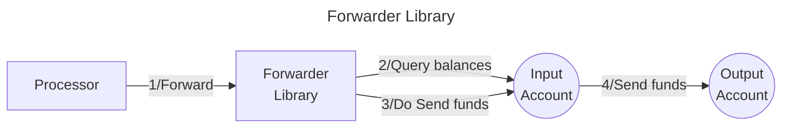

# Valence Forwarder library

The **Valence Forwarder** library allows to **continuously forward funds** from an **input account** to an **output account**, following some time **constraints**. It is typically used as part of a **Valence Program**. In that context, a **Processor** contract will be the main contract interacting with the Forwarder library.

## High-level flow



## Configuration

The library is configured on instantiation via the `LibraryConfig` type.

```rust
pub struct LibraryConfig {
    // Account from which the funds are pulled
    pub input_addr: LibraryAccountType,
    // Account to which the funds are sent
    pub output_addr: LibraryAccountType,
    // Forwarding configuration per denom
    pub forwarding_configs: Vec<UncheckedForwardingConfig>,
    // Constraints on forwarding operations
    pub forwarding_constraints: ForwardingConstraints,
}

pub struct UncheckedForwardingConfig {
    // Unverified denom (either native or CW20)
    pub denom: UncheckedDenom,
    // Max amount of tokens to be transferred per Forward operation
    pub max_amount: Uint128,
}

// Time constraints on forwarding operations
pub struct ForwardingConstraints {
    // Minimum interval between 2 successive forward operations,
    // specified either as a number of blocks, or as a time delta.
    min_interval: Option<Duration>,
}
```
