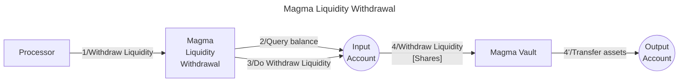

# Magma withdrawer library

The **Valence Magma Withdrawer library** allows users to **withdraw liquidity** from Magma Vault from an **input account** and receive the withdrawn tokens into an **output account**.

## High-level flow


| Function    | Parameters | Description |
|-------------|------------|-------------|
| **WithdrawLiquidity** | `shares: Uint128` <br>`amount_0_min: Option<Uint128>` <br>`amount_1_min: Option<Uint128>` |  Withdraw liquidity from the configured **Magma Vault** from the **input account**, and receive tokens to the configured **output account**. 

## Configuration

The library is configured on instantiation via the `LibraryConfig` type.

```rust
pub struct LibraryConfig {
    // Address of the input account 
    pub input_addr: LibraryAccountType,
    // Address of the output account 
    pub output_addr: LibraryAccountType,
    // Address of the vault we are going to withdraw liquidity from 
    pub vault_addr: String,
}
```

## Implementation Details

### Withdrawal Process

1. **Balance Check**: Queries the balance of the shares in the input account. To withdraw liquidity, the wallet address must have a positive balance or balance greater than input withdraw shares amount.
2. **Withdraw Liquidity**: Executes a `Withdraw` message, which withdraws the specified shares of liquidity to the Valence input account.

## Error Handling

- **No Funds**: Returns an error if attempting to withdraw with a zero or less than provided input value of shares.

