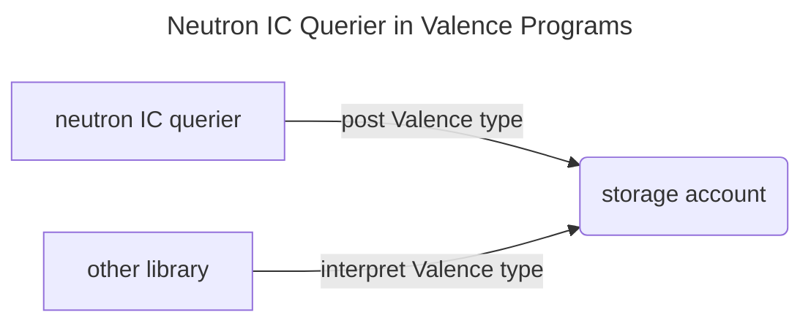

# Neutron Interchain Querier

**Neutron Interchain Querier library** enables Valence Programs to configure and carry out
KV-based queries enabled by the `interchainqueries` module on Neutron.

## Prerequisites

### Active Neutron ICQ relayer

This library requires active [Neutron ICQ Relayers](https://github.com/neutron-org/neutron-query-relayer) operating on the specified target route.

### Valence Middleware broker

Each KV-based query requires a correctly encoded key in order to be registered.
This library obtains the query keys from [Valence Middleware brokers](./../middleware/broker.md),
which expose particular type registries.

For a given KV-query to be performed, the underlying type registry must implement `IcqIntegration` trait
which in turn enables the following functionality:
1. `get_kv_key`, enabling the ability to get the correctly encoded `KVKey` for query registration
2. `decode_and_reconstruct`, allowing to reconstruct the interchain query result

Read more about the given type ICQ integration in the [type registry documentation page](./../middleware/type_registry.md#neutron-interchain-query-integration).

### Valence Storage account

Results received and meant for further processing by other libraries will be persisted
to Valence [Storage Accounts](./../components/storage_account.md). Each instance of Neutron
IC querier will be associated with its own storage account.

### Query registration fee

Neutron `interchainqueries` module is configured to escrow a fee in order to register a query.
The fee parameter is dynamic and can be queried via the `interchainqueries` module.
Currently the fee is set to `100000untrn`, but it may change in the future.
Users must ensure that the fee is provided along with the query registration function call.

### Query deregistration

Interchain Query escrow payments can be reclaimed by submitting the `RemoveInterchainQuery` message.
Only the query owner (this contract) is able to submit this message.

Interchain Queries should be removed after they are no longer needed, however, that moment may be different for each Valence Program depending on its configuration.

### Background on the `interchainqueries` module

#### Query Registration Message types

Interchain queries can be registered and unregistered by submitting the following `neutron-sdk` messages:

```rust
pub enum NeutronMsg {
	// other variants
	RegisterInterchainQuery {
		/// **query_type** is a query type identifier ('tx' or 'kv' for now).
		query_type: String,

		/// **keys** is the KV-storage keys for which we want to get values from remote chain.
		keys: Vec<KVKey>,

		/// **transactions_filter** is the filter for transaction search ICQ.
		transactions_filter: String,

		/// **connection_id** is an IBC connection identifier between Neutron and remote chain.
		connection_id: String,

		/// **update_period** is used to say how often the query must be updated.
		update_period: u64,
	},
	RemoveInterchainQuery {
    query_id: u64,
	},
}
```

where the `KVKey` is defined as follows:

```rust
pub struct KVKey {
    /// **path** is a path to the storage (storage prefix) where you want to read value by key (usually name of cosmos-packages module: 'staking', 'bank', etc.)
    pub path: String,

    /// **key** is a key you want to read from the storage
    pub key: Binary,
}
```

`RegisterInterchainQuery` variant can be applied for both *tx*- and *kv*-based queries.
Given that this library is meant for dealing with *kv*-based queries exclusively,
`transactions_filter` field is irrelevant.

This library constructs the query registration message as follows:

```rust
    // helper
    let kv_registration_msg = NeutronMsg::register_interchain_query(
        QueryPayload::KV(vec![query_kv_key]),
        "connection-3".to_string(),
        5,
    );
    // which translates to:
    let kv_registration_msg = NeutronMsg::RegisterInterchainQuery {
        query_type: QueryType::KV.into(),
        keys: vec![query_kv_key],
        transactions_filter: String::new(),
        connection_id: "connection-3".to_string(),
        update_period: 5,
    }
```

`query_kv_key` here is obtained by querying the associated middleware broker for a given type and query parameters.

#### Query Result Message types

After a query is registered and fetched back to Neutron, its results can be queried with the following Neutron query:

```rust
pub enum NeutronQuery {
    /// Query a result of registered interchain query on remote chain
    InterchainQueryResult {
        /// **query_id** is an ID registered interchain query
        query_id: u64,
    },
	// other types
}
```

which will return the interchain query result:

```rust
pub struct InterchainQueryResult {
    /// **kv_results** is a raw key-value pairs of query result
    pub kv_results: Vec<StorageValue>,

    /// **height** is a height of remote chain
    pub height: u64,

    #[serde(default)]
    /// **revision** is a revision of remote chain
    pub revision: u64,
}
```

where `StorageValue` is defined as:

```rust
/// Describes value in the Cosmos-SDK KV-storage on remote chain
pub struct StorageValue {
    /// **storage_prefix** is a path to the storage (storage prefix) where you want to read
    /// value by key (usually name of cosmos-packages module: 'staking', 'bank', etc.)
    pub storage_prefix: String,

    /// **key** is a key under which the **value** is stored in the storage on remote chain
    pub key: Binary,

    /// **value** is a value which is stored under the **key** in the storage on remote chain
    pub value: Binary,
}
```

## Interchain Query lifecycle

After `RegisterInterchainQuery` message is submitted, `interchainqueries` module will deduct
the query registration fee from the caller.

At that point the query is assigned its unique `query_id` identifier, which is not known in advance.
This identifier is returned to the caller in the reply.

Once the query is registered, the interchain query relayers performs the following steps:

1. fetch the specified value from the target domain
2. post the query result to `interchainqueries` module
3. trigger `SudoMsg::KVQueryResult` endpoint on the contract that registered the query

`SudoMsg::KVQueryResult` does not carry back the actual query result. Instead, it posts back
a `query_id` of the query which had been performed, announcing that its result is available.

Obtained `query_id` can then be used to query the `interchainqueries` module for the **raw**
interchainquery result. One thing to note here is that these raw results are not meant to be
(natively) interpreted by foreign VMs; instead, they will adhere to the encoding schemes of
the origin domain.

## Library high-level flow

At its core, this library should enable three key functions:

1. initiating the interchain queries
2. receiving & postprocessing the query results
3. reclaiming the escrowed fees by unregistering the queries

Considering that Valence Programs operate across different VMs and adhere to their rules,
these functions can be divided into two categories:

1. external operations (Valence <> host VM)
2. internal operations (Valence <> Valence)

From this perspective, query initiation, receival, and termination can be seen as external
operations that adhere to the functionality provided by the `interchainqueries` module on Neutron.

On the other hand, query result postprocessing involves internal Valence Program operations.
KV-Query query results fetched from remote domains are not readily useful within the Valence
scope because of their encoding formats. Result postprocessing is therefore about adapting
remote domain data types into [canonical Valence Protocol data types](./../middleware/valence_types.md)
that can be reasoned about.

> For most cosmos-sdk based chains, KV-storage values are encoded in protobuf. Interpreting
protobuf from within cosmwasm context is not straightforward and requires explicit conversion
steps. Other domains may store their state in other encoding formats. This library does not
make any assumptions about the different encoding schemes that remote domains may be subject
to - instead, that responsibility is handed over to [Valence Middleware](./../middleware/_overview.md).

Final step in result postprocessing is about persisting the canonicalized query results.
Resulting Valence Types are written into a [Storage Account](./../components/storage_account.md),
making it available for further processing, interpretation, or other types of processing.

## Library Lifecycle

With the baseline functionality in mind, there are a few design decisions
that shape the overall lifecycle of this library.

### Instantiation flow

Neutron Interchain Querier is instantiated with the full configuration needed
to initiate and process the queries that it will be capable of executing.
After instantiation, the library has the full context needed to carry out its
functions.

Library is configured with the following `LibraryConfig`. Further sections
will focus on each of its fields.

```rust
pub struct LibraryConfig {
    pub storage_account: LibraryAccountType,
    pub querier_config: QuerierConfig,
    pub query_definitions: BTreeMap<String, QueryDefinition>,
}
```

#### Storage Account association

Like other libraries, Neutron IC querier has a notion of its associated account.

Associated Storage account will authorize libraries like Neutron IC Querier
to persist canonical Valence types under its storage.

Unlike most other libraries, IC querier does not differentiate between input and
output accounts. There is just an account, and it is the only account that this
library will be authorized to post its results into.

Storage account association follows the same logic of approve/revoke as in other
libraries. Its configuration is done via `LibraryAccountType`, following
the same account pattern as other libraries.

#### Global configurations that apply to all queries

While this library is capable of carrying out an arbitrary number of distinct
interchain queries, their scope is bound by `QuerierConfig`

`QuerierConfig` describes ICQ parameters that will apply to every query to be
managed by this library. It can be seen as the global configuration parameters,
of which there are two:

```rust
pub struct QuerierConfig {
    pub broker_addr: String,
    pub connection_id: String,
}
```

`connection_id` here describes the IBC connection between Neutron and the
target domain. This effectively limits each instance of Neutron IC Querier to
be responsible for querying one particular domain.

`broker_addr` describes the address of the associated middleware broker.
Just as all queries are going to be bound by a particular connection id,
they will also be postprocessed using a single broker instance.

#### Query configurations

Queries to be carried out by this library are configured with the following
type:

```rust
pub struct QueryDefinition {
    pub registry_version: Option<String>,
    pub type_url: String,
    pub update_period: Uint64,
    pub params: BTreeMap<String, Binary>,
    pub query_id: Option<u64>,
}
```

- `registry_version: Option<String>` specifies which version of the type registry
the middleware broker should use. When set to `None`, the broker uses its latest
available type registry version. Set this field when a specific type registry
version is needed instead of the latest one.
- `type_url: String` identifies the query type within the type registry (via broker).
An important thing to note here is that this url may differ from the one used to
identify the target type on its origin domain. This decoupling is done intentionally
in order to allow for flexible type mapping between domains when necessary.
- `update_period: Uint64` specifies how often the given query should be performed/updated
- `params: BTreeMap<String, Binary>` provides the type registry with the base64
encoded query parameters that are going to be used for `KVKey` construction
- `query_id: Option<u64>` is an internal parameter that gets modified during runtime.
It must be set to `None` when configuring the library.

Every query definition must be associated with a unique string-based identifier (key).
Query definitions are passed to the library config via `BTreeMap<String, QueryDefinition>`,
which ensures that there is only one `QueryDefinition` for every key. While these
keys can be anything, they should clearly identify a particular query. Every function
call exposed by this library expects these keys (and only these keys) as their arguments.

### Execution flow

With Neutron IC Querier instantiated, the library is ready to start carrying
out the queries.

#### Query registration

Configured queries can be registered with the following function:

```rust
RegisterKvQuery { target_query: String }
```

Query registration flow consists of the following steps:

1. querying the `interchainqueries` module for the currently set query
registration fee and asserting that the function caller covered all
expected fees
2. querying the middleware broker to obtain the `KVKey` value to be used
in ICQ registration
3. constructing and firing the ICQ registration message

Each configured query can be started with this function call.

#### Query result processing

Interchain Query results are delivered to the `interchainqueries` module
in an asynchronous manner. To ensure that query results are available to
Valence Programs as fresh as possible, this library leverages `sudo` callbacks
that are triggered after ICQ relayers post back the results for a query
registered by this library.

This entry point is configured as follows:

```rust
pub fn sudo(deps: ExecuteDeps, _env: Env, msg: SudoMsg) -> StdResult<Response<NeutronMsg>> {
    match msg {
        // this is triggered by the ICQ relayer delivering the query result
        SudoMsg::KVQueryResult { query_id } => handle_sudo_kv_query_result(deps, query_id),
        _ => Ok(Response::default()),
    }
}
```

This function call triggers a set of actions that will process the raw query
result into a canonical Valence Type before posting it into the associated
Storage account:

1. query the `interchainqueries` module to obtain the raw query result
associated with the given `query_id`
2. query the broker to deserialize the proto-encoded result into a rust type
3. query the broker to canonicalize the native rust type into `ValenceType`
4. post the resulting canonical type to the associated storage account

After these actions, the associated storage account will hold the adapted query
result in its storage on the same block as the result was brought into Neutron.

#### Query deregistration

Actively registered queries can be removed from the active query set with the
following function:

```rust
DeregisterKvQuery { target_query: String }
```

This function will perform two actions.

First it will query the `interchainqueries` module on Neutron for the `target_query`.
This is done in order to find the deposit fee that was escrowed upon query
registration.

Next, the library will submit the query removal request to the `interchainqueries`
module. If this request is successful, the deposit fee tokens will be transferred
to the sender that initiated this function.

## Library in Valence Programs

Neutron IC Querier does not behave as a standard library in that it does result in
any fungible outcome. Instead, it produces a data object in the form of Valence Type.

While that result could be posted directly to the state of this library,
instead, it is posted to an associated output account meant for storing data.
Just as some other libraries have a notion of input accounts that grant them
the permission of executing some logic, Neutron IC Querier has a notion of an
associated account which grants the querier a permission to writing some data
into its storage slots.

For example, consider a situation where this library had queried the balance of
some remote account, parsed the response into a Valence Balance type, and wrote
that resulting object into its associated storage account. That same associated
account may be the input account of some other library, which will attempt to
perform its function based on the content written to its input account. This may
involve something along the lines of: `if balance > 0, do x; otherwise, do y;`.

With that, the IC Querier flow in a Valence Program may look like this:



> Valence Middleware is being actively developed. More elaborate examples
of this library will be added here in the future.
