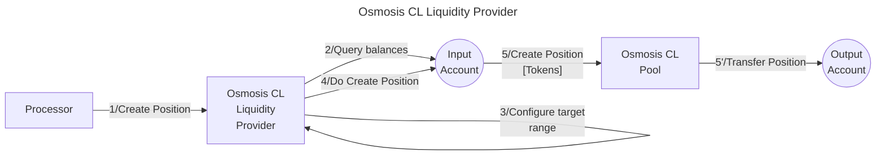

# Osmosis CL LPer library

The **Valence Osmosis CL LPer library** library allows to **create concentrated liquidity
positions** on **Osmosis** from an **input account**, and transfer the **position** to an **output account**.

## High-level flow



## Concentrated Liquidity Position creation

Because of the way CL positions are created, there are two ways to achieve it:

### Default

Default position creation centers around the idea of creating a position
with respect to the currently active tick of the pool.

This method expects a single parameter, `bucket_amount`, which describes
how many *buckets* of the pool should be taken into account to both sides
of the price curve.

Consider a situation where the current tick is 125, and the configured
tick spacing is 10.

If this method is called with `bucket_amount` set to 5, the following logic
will be performed:
- find the current bucket range, which is 120 to 130
- extend the current bucket ranges by 5 buckets to both sides, meaning
that the range "to the left" will be extended by 5 * 10 = 50, and the
range "to the right" will be extended by 5 * 10 = 50, resulting in the covered
range from 120 - 50 = 70 to 130 + 50 = 180, giving the position tick range of (70, 180).

### Custom

Custom position creation allows for more fine-grained control over the
way the position is created.

This approach expects users to specify the following parameters:
- `tick_range`, which describes the price range to be covered
- `token_min_amount_0` and `token_min_amount_1` which are optional
parameters that describe the minimum amount of tokens that should be
provided to the pool.

With this flexibility a wide variety of positions can be created, such as
those that are entirely single-sided.

## Functions

| Function    | Parameters | Description |
|-------------|------------|-------------|
| **ProvideLiquidityDefault** | `bucket_amount: Uint64` | Create a position on the pre-configured **Osmosis Pool** from the **input account**, following the [Default approach](#default) described above, and transfer the **position** to the **output account**. |
| **ProvideLiquidityCustom** | `tick_range: TickRange`<br>`token_min_amount_0: Option<Uint128>`<br>`token_min_amount_1: Option<Uint128>` | Create a position on the pre-configured **Osmosis Pool** from the **input account**, following the [Custom approach](#custom) described above, and transfer the **position** to the **output account**. |

## Configuration

The library is configured on instantiation via the `LibraryConfig` type.

```rust
pub struct LibraryConfig {
    // Account from which the funds are LPed
    pub input_addr: LibraryAccountType,
    // Account to which the LP position is forwarded
    pub output_addr: LibraryAccountType,
    // LP configuration
    pub lp_config: LiquidityProviderConfig,
}

pub struct LiquidityProviderConfig {
    // ID of the Osmosis CL pool
    pub pool_id: Uint64,
    // Pool asset 1 
    pub pool_asset_1: String,
    // Pool asset 2
    pub pool_asset_2: String,
    // Pool global price range
    pub global_tick_range: TickRange,
}
```
