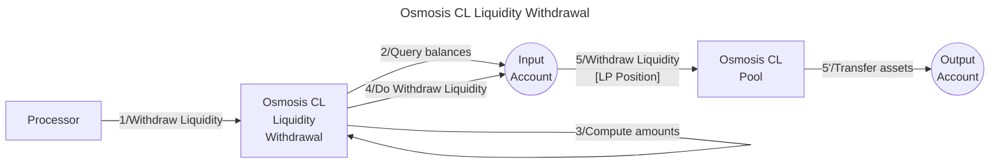

# Osmosis CL liquidity withdrawer library

The **Valence Osmosis CL Withdrawer library** library allows to **withdraw a concentrated liquidity
positions** off an **Osmosis** pool from an **input account**, and transfer the resulting tokens to an **output account**.

## High-level flow



## Functions

| Function    | Parameters | Description |
|-------------|------------|-------------|
| **WithdrawLiquidity** | `position_id: Uint64`<br>`liquidity_amount: String` |  Withdraw liquidity from the configured **Osmosis Pool** from the **input account**, according to the given parameters, and transfer the withdrawned tokens to the configured **output account** |

## Configuration

The library is configured on instantiation via the `LibraryConfig` type.

```rust
pub struct LibraryConfig {
    // Account holding the LP position
    pub input_addr: LibraryAccountType,
    // Account to which the withdrawn assets are forwarded
    pub output_addr: LibraryAccountType,
    // ID of the pool
    pub pool_id: Uint64,
}
```
