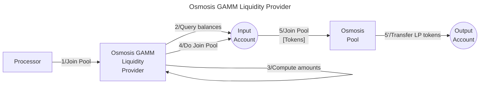

# Osmosis GAMM LPer library

The **Valence Osmosis GAMM LPer library** library allows to **join a pool** on **Osmosis**, using the **GAMM module** (Generalized Automated Market Maker), from an **input account**, and transfer the **position** to an **output account**.

## High-level flow



## Functions

| Function    | Parameters | Description |
|-------------|------------|-------------|
| **ProvideDoubleSidedLiquidity** | `expected_spot_price: Option<DecimalRange>` | Provide double-sided liquidity to the pre-configured **Osmosis Pool** from the **input account**, and deposit the **LP tokens** into the **output account**. Abort it the spot price is not within the `expected_spot_price` range (if specified). |
| **ProvideSingleSidedLiquidity** | `asset: String`<br>`limit: Option<Uint128>`<br>`expected_spot_price: Option<DecimalRange>` | Provide single-sided liquidity for the specified `asset` to the pre-configured **Osmosis Pool** from the **input account**, and deposit the **LP tokens** into the **output account**. Abort it the spot price is not within the `expected_spot_price` range (if specified). |

## Configuration

The library is configured on instantiation via the `LibraryConfig` type.

```rust
pub struct LibraryConfig {
    // Account from which the funds are LPed
    pub input_addr: LibraryAccountType,
    // Account to which the LP position is forwarded
    pub output_addr: LibraryAccountType,
    // LP configuration
    pub lp_config: LiquidityProviderConfig,
}

pub struct LiquidityProviderConfig {
    // ID of the Osmosis pool
    pub pool_id: Uint64,
    // Pool asset 1 
    pub pool_asset_1: String,
    // Pool asset 2
    pub pool_asset_2: String,
}
```
