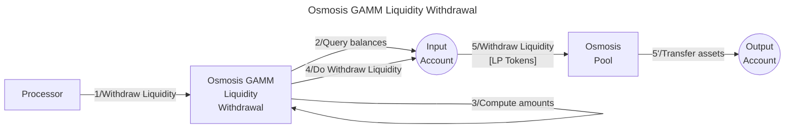

# Osmosis GAMM liquidity withdrawer library

The **Valence Osmosis GAMM Withdrawer library** library allows to **exit a pool** on **Osmosis**, using the **GAMM module** (Generalized Automated Market Maker), from an **input account**, an deposit the withdrawed tokens into an **output account**.

## High-level flow



## Functions

| Function    | Parameters | Description |
|-------------|------------|-------------|
| **WithdrawLiquidity** | - |  Withdraw liquidity from the configured **Osmosis Pool** from the **input account** and deposit the withdrawed tokens into the configured **output account** |

## Configuration

The library is configured on instantiation via the `LibraryConfig` type.

```rust
pub struct LibraryConfig {
    // Account from which the funds are LPed
    pub input_addr: LibraryAccountType,
    // Account to which the LP tokens are forwarded
    pub output_addr: LibraryAccountType,
    // Liquidity withdrawer configuration
    pub withdrawer_config: LiquidityWithdrawerConfig,
}

pub struct LiquidityWithdrawerConfig {
    // ID of the pool
    pub pool_id: Uint64,
}
```
