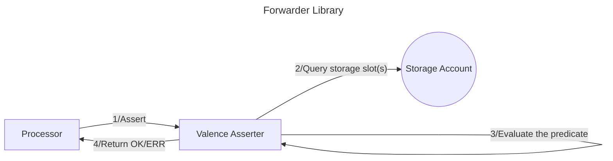

# Valence Asserter

**Valence Asserters** provide the means to assert boolean conditions about [Valence Types](./valence_types.md).

Each Valence Type variant may provide different assertion queries. To offer a unified API, Valence Asserter
remains agnostic to the underlying type being queried and provides a common gateway to all available types.

## Motivation

Primary use case for Valence Type assertions is to enable **conditional execution** of functions.
A basic example of this may be expressed as "*provide liquidity if and only if the pool price is greater than X*".

While specific conditions like this could be internalized in each function that is to be executed, Valence Asserter
aims to:
- enable such assertions to be performed prior to any library function (system level)
- not limit the assertions to a particular condition (generalize)

With the following goals satisfied, arbitrary assertions can be performed on the [processor](./../authorizations_processors/processor.md) level.

Each function call that the configured program wishes to execute only if a certain condition is met can then
be placed in a message batch and prepended with an assertion message.
This way, when the message batch is being processed, any assertions that do not evaluate to true (return an `Err`) will
prevent later messages from executing as expected. If the batch is *atomic*, the whole batch will abort.
If the batch is *non-atomic*, various [authorization](./../authorizations_processors/authorization_contract.md) configuration
options will dictate the further behavior.

## High-level flow



## API

| Function    | Parameters | Description | Return Value |
|-------------|------------|-------------|--------------|
| **Assert** | `a: AssertionValue`<br>`predicate: Predicate`<br>`b: AssertionValue` | Evaluate the given predicate *R(a, b)*.<br>If *a* or *b* are variables, they get fetched using the configuartion specified in the respective `QueryInfo`.<br>Both *a* and *b* must be deserializable into the same type. |- predicate evaluates to true: `Ok()`<br>- predicate evaluates to false: `Err` |


## Design

Assertions to be performed are expressed as *R(a, b)*, where:

- *a* and *b* are values of the same type
- *R* is the predicate that applies to *a* and *b*

Valence Asserter design should enable such predicate evaluations to be performed in a generic manner within Valence Programs.

### Assertion values

Assertion values are defined as follows:

```rust
pub enum AssertionValue {
    // storage account slot query
    Variable(QueryInfo),
    // constant valence primitive value
    Constant(ValencePrimitive),
}
```

Two values are required for any comparison. Both *a* and *b* can be configured to be obtained in one of two ways:

1. Constant value (known before program instantiation)
2. Variable value (known during program runtime)

Any combination of these values can be used for a given assertion:

- constant-constant (unlikely)
- constant-variable
- variable-variable

#### `Variable` assertion values

Variable assertion values are meant to be used for information that can only become known during runtime.

Such values will be obtained from Valence Types, which expose their own set of queries.

Valence Types reside in their dedicated storage slots in [Storage Accounts](./../components/storage_account.md).

Valence Asserter uses the following type in order to obtain the Valence Type and query its state:

```rust
pub struct QueryInfo {
    // addr of the storage account
    pub storage_account: String,
    // key to access the value in the storage account
    pub storage_slot_key: String,
    // b64 encoded query
    pub query: Binary,
}
```

#### `Constant` assertion values

Constant assertion values are meant to be used for assertions where one of the operands is known before runtime.

Valence Asserter expects constant values to be passed using the `ValencePrimitive` enum which wraps around the standard `cosmwasm_std` types:

```rust
pub enum ValencePrimitive {
    Decimal(cosmwasm_std::Decimal),
    Uint64(cosmwasm_std::Uint64),
    Uint128(cosmwasm_std::Uint128),
    Uint256(cosmwasm_std::Uint256),
    String(String),
}
```

### Predicates

Predicates *R* are specified with the following type:

```rust
pub enum Predicate {
    LT,  // <
    LTE, // <=
    EQ,  // ==
    GT,  // >
    GTE, // >=
}
```

In the context of Valence Asserter, the predicate treats `a` as the left-hand-side and `b` as the right-hand-side variables (`a < b`).

> While comparison of numeric types is pretty straightforward, it is important to note that string predicates are evaluated in lexicographical order and are case sensitive:
> - "Z" < "a"
> - "Assertion" != "assertion"

### Example

Consider that a Valence Program wants to provide liquidity to a liquidity pool if and only if
the pool price is above `10.0`.

Pool price can be obtained by querying a `ValenceXykPool` variant which exposes the following query:

```rust
ValenceXykQuery::GetPrice {} -> Decimal
```

The program is configured to store the respective `ValenceXykPool` in a Storage Account with address
`neutron123...`, under storage slot `pool`.

Filling in the blanks of *R(a, b)*, we have:

- variable `a` is obtained with the `GetPrice {}` query of `neutron123...` storage slot `pool`
- predicate `R` is known in advance: `>`
- constant `b` is known in advance: `10.0`

Thefore the assertion message may look as follows:

```json
"assert": {
  "a": {
    "variable": {
      "storage_account": "neutron123...",
      "storage_slot": "pool",
      "query": b64("GetPrice {}"),
    }
  },
  "predicate": Predicate::GT,
  "b": {
    "constant": "10.0",
  },
}
```
