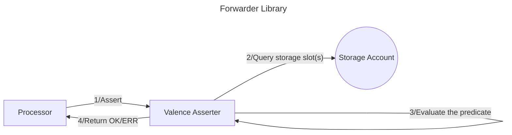

# Valence Asserter

**Valence Asserters** provide the means to assert boolean conditions about [Valence Types](./valence_types.md).

Each Valence Type variant may provide different assertion queries. To offer a unified API, Valence Asserter
remains agnostic to the underlying type being queried and provides a common gateway to all available types.

## High-level flow



## Motivation

Primary use case for Valence Type assertions is to enable **conditional execution** of functions.
A basic example of this may be expressed as "*provide liquidity if and only if the pool price is greater than X*".

While specific conditions like this could be internalized in each function that is to be executed, Valence Asserter
aims to:
- enable such assertions to be performed prior to any library function (system level)
- not limit the assertions to a particular condition (generalize)

With the following goals satisfied, arbitrary assertions can be performed on the [processor](./../authorizations_processors/processor.md) level.

Each function call that the configured program wishes to execute only if a certain condition is met can then
be placed in a message batch and prepended with an assertion message.
This way, when the message batch is being processed, any assertions that do not evaluate to true (return an `Err`) will
prevent later messages from executing as expected. If the batch is *atomic*, the whole batch will abort.
If the batch is *non-atomic*, various [authorization](./../authorizations_processors/authorization.md) configuration
options will dictate the further behavior.

## Design

Assertions to be performed are expressed as *R(a, b)*, where:

- *a* and *b* are values of the same type
- *R* is the predicate that applies to *a* and *b*

Valence Asserter design should enable the evaluation of such predicates in Valence Programs.

### Comparison values

Two values are required for any comparison. In Valence Programs, both *a* and *b* will be obtained differently.

> TODO: rethink whether we should limit one of the values to be constant. can we just treat both *a* & *b* as equals,
where they can be configured as const or variable?

#### variable *a*

*a* is the variable that will only become known during runtime.
Such values will be obtained from Valence Types which expose their own set of queries.
Valence Types reside in their dedicated storage slots in [Storage Accounts](./../components/storage_account.md).

#### constant *b*


*b* is the value that *a* will be evaluated against. Setting *b* values can be done in multiple ways
and follows the rules set by the authorizations module.

### Predicates

In a broad sense, predicates *R* should follow the logic outlined by `std::cmp::{PartialEq, Eq, PartialOrd, Ord}`.
This means enabling the following operators:

- `<`
- `<=`
- `==`
- `>`
- `>=`

### Example

Consider that a Valence Program wants to provide liquidity to a liquidity pool if and only if
the pool price is above `10.0`.

Pool price can be obtained by querying a `ValenceXykPool` variant which exposes the following query variant:

```rust
ValenceXykQuery::GetPrice {} -> Decimal
```

The program is configured to store the respective `ValenceXykPool` in a Storage Account with address
`neutron123...`, under storage slot `pool`.

Filling in the blanks of `*R(a, b)*`, we have:

- variable `a` is obtained with the `GetPrice {}` query of `neutron123...` storage slot `pool`
- predicate `R` is known in advance: `>`
- constant `b` is known in advance: `10.0`

Thefore the assertion message may look as follows:

```json
"assert": {
  "a": {
    "variable": {
      "storage_account": "neutron123...",
      "storage_slot": "pool",
      "query": b64("GetPrice {}"),
    }
  },
  "predicate": Predicate::GT,
  "b": {
    "constant": "10.0",
  },
  "ty": "decimal"
}
```

## Type definitions

The following types are introduced:

```rust
pub enum Predicate {
    LT,
    LTE,
    EQ,
    GT,
    GTE,
}

pub struct QueryInfo {
    // addr of the storage account
    storage_account: String,
    // key to access the value in the storage account
    storage_slot_key: String,
    // b64 encoded query
    query: Binary,
}

pub enum AssertionValue {
    // storage account slot query
    Variable(QueryInfo),
    // serialized constant value
    Constant(String),
}

// type that both values are expected to be
pub enum ValueType {
    Decimal,
    Uint64,
    Uint128,
    Uint256,
    String,
}

pub struct AssertionConfig {
    a: AssertionValue,
    predicate: Predicate,
    b: AssertionValue,
    ty: ValueType,
}
```

## API

| Function    | Parameters | Description | Return Value |
|-------------|------------|-------------|--------------|
| **Assert** | `a: AssertionValue`<br>`predicate: Predicate`<br>`b: AssertionValue`<br>`ty: ValueType` | Evaluate the given predicate (*R(a, b)*). If *a* or *b* are variables, they get fetched using the configuartion specified in the respective `QueryInfo`.  | - predicate evaluates to true -> `Ok(())` <br> - predicate evaluates to false -> `Err` |
