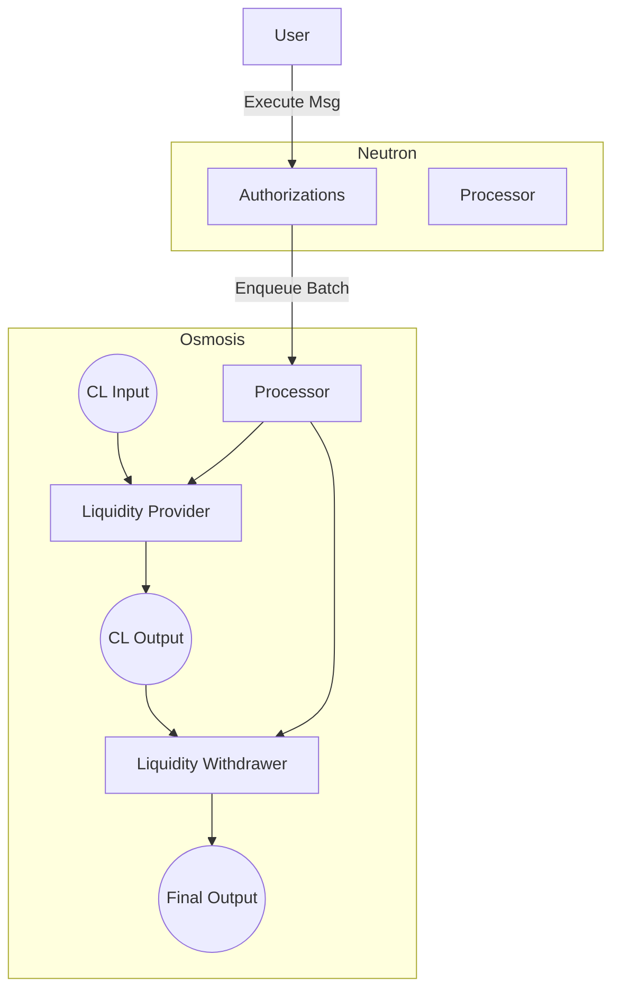

# Example with Program Manager
This example demonstrates how to test your program using the Program Manager after your initial testing set up has been completed as described in the [Initial Testing Set Up](./setup.md) section.

> **Use-case:** This example outlines the steps needed to create a program that provides and withdraws liquidity from an Osmosis Concentrated Liquidity pool using two library contracts: a CL Liquidity Provider and a CL Liquidity Withdrawer.

## Prerequisites
Before proceeding, ensure you have:
- A basic understanding of Osmosis, Neutron, CosmWasm, and Valence
- Completed the initial testing setup as described in the setup section
- Installed all necessary dependencies and have a working development environment

## Solution Overview
Full working code for this example can be found in the [Osmosis Concentrated Liquidity example](https://github.com/timewave-computer/valence-protocol/blob/main/examples/osmo_cl/src).

Our solution includes the following:
- We create three accounts on Osmosis
    - CL Input holds tokens ready to join the pool
    - CL Output holds the position of the pool
    - Final Output holds tokens after they've been withdrawn from the pool
- We instantiate the Concentrated Liquidity Provider and Concentrated Liquidity Withdrawer libraries on Osmosis
    - The Liquidity Provider library will draw tokens from the CL Input account and use them to enter the pool
    - The Liquidity Withdrawer library will exit the pool from the position held in the CL Output account and deposit redeemed tokens to the Final Output account
- We add two permissionless authorizations on Neutron:
    - Provide Liquidity: When executed, it'll call the the provide liquidity function
    - Withdraw Liquidity: When executed, it'll call the withdraw liquidity function

The following is a visual representation of the system we are building:


## Code walkthrough
Before we begin, we set up the `TestContext` as explained in the previous [setup section](setup.md). Then we can move on to steps pertinent to testing this example.

### 1. Setting up the program

#### 1.1 Set up the Concentrated Liquidity pool on Osmosis

```rust
let ntrn_on_osmo_denom = test_ctx
    .get_ibc_denom()
    .base_denom(NEUTRON_CHAIN_DENOM.to_owned())
    .src(NEUTRON_CHAIN_NAME)
    .dest(OSMOSIS_CHAIN_NAME)
    .get();

let pool_id = setup_cl_pool(&mut test_ctx, &ntrn_on_osmo_denom, OSMOSIS_CHAIN_DENOM)?;
```

This sets up a CL pool on Osmosis using NTRN and OSMO as the trading pair.
Because NTRN on Osmosis will be transferred over IBC, a helper function is used to get the correct denom on Osmosis.

#### 1.2 Set up the Program config builder and prepare the relevant accounts

The Program Manager uses a builder pattern to construct the program configuration. We set up the three accounts that will be used in the liquidity provision and withdrawal flow.

```rust
let mut builder = ProgramConfigBuilder::new(NEUTRON_CHAIN_ADMIN_ADDR.to_string());
let osmo_domain = Domain::CosmosCosmwasm(OSMOSIS_CHAIN_NAME.to_string());
let ntrn_domain = Domain::CosmosCosmwasm(NEUTRON_CHAIN_NAME.to_string());

// Create account information for LP input, LP output and final (LW) output accounts
let cl_input_acc_info = AccountInfo::new("cl_input".to_string(), &osmo_domain, AccountType::default());
let cl_output_acc_info = AccountInfo::new("cl_output".to_string(), &osmo_domain, AccountType::default());
let final_output_acc_info = AccountInfo::new("final_output".to_string(), &osmo_domain, AccountType::default());

// Add accounts to builder
let cl_input_acc = builder.add_account(cl_input_acc_info);
let cl_output_acc = builder.add_account(cl_output_acc_info);
let final_output_acc = builder.add_account(final_output_acc_info);
```

#### 1.3 Configure the libraries

Next we configure the libraries for providing and withdrawing liquidity. Each library is configured with input and output accounts and specific parameters for their operation.

Note how `cl_output_acc` serves a different purpose for each of those libraries:
- for liquidity provider library it is the output account
- for liquidity withdrawer library it is the input account

```rust
// Configure Liquidity Provider library
let cl_lper_config = LibraryConfig::ValenceOsmosisClLper({
    input_addr: cl_input_acc.clone(),
    output_addr: cl_output_acc.clone(),
    lp_config: LiquidityProviderConfig {
        pool_id: pool_id.into(),
        pool_asset_1: ntrn_on_osmo_denom.to_string(),
        pool_asset_2: OSMOSIS_CHAIN_DENOM.to_string(),
        global_tick_range: TickRange {
            lower_tick: Int64::from(-1_000_000),
            upper_tick: Int64::from(1_000_000),
        },
    },
});

// Configure Liquidity Withdrawer library
let cl_lwer_config = LibraryConfig::ValenceOsmosisClWithdrawer({
    input_addr: cl_output_acc.clone(),
    output_addr: final_output_acc.clone(),
    pool_id: pool_id.into(),
});

// Add libraries to builder
let cl_lper_library = builder.add_library(LibraryInfo::new(
    "test_cl_lper".to_string(),
    &osmo_domain,
    cl_lper_config,
));

let cl_lwer_library = builder.add_library(LibraryInfo::new(
    "test_cl_lwer".to_string(),
    &osmo_domain,
    cl_lwer_config,
));
```

#### 1.4 Create links between accounts and libraries
Input links (first array in the `add_link()` call) are meant to enable libraries permission to execute on the specified accounts. Output links specify where the fungible results of a given function execution should be routed to.

```rust
// Link input account -> liquidity provider -> output account
builder.add_link(&cl_lper_library, vec![&cl_input_acc], vec![&cl_output_acc]);
// Link output account -> liquidity withdrawer -> final output account
builder.add_link(&cl_lwer_library, vec![&cl_output_acc], vec![&final_output_acc]);
```

#### 1.5 Create authorizations
Next we create authorizations for both providing and withdrawing liquidity. Each authorization contains a subroutine that specifies which function to call on which library. By default, calling these subroutines will be permissionless, however using the `AuthorizationBuilder` we can constrain the authorizations as necessary.

```rust
builder.add_authorization(
    AuthorizationBuilder::new()
        .with_label("provide_liquidity")
        .with_subroutine(
            AtomicSubroutineBuilder::new()
                .with_function(cl_lper_function)
                .build(),
        )
        .build(),
);

builder.add_authorization(
    AuthorizationBuilder::new()
        .with_label("withdraw_liquidity")
        .with_subroutine(
            AtomicSubroutineBuilder::new()
                .with_function(cl_lwer_function)
                .build(),
        )
        .build(),
);
```

#### 1.6 Set up the Polytone connections
In order for cross-domain Programs to be able to communicate between
different domains, we instantiate the Polytone contracts and save the
configuration in our Program Manager.

`setup_polytone` sets up the connection between two domains and therefore expects the following parameters:

- source and destination chain names
- source and destination chain ids
- source and destination chain native denoms

```rust
// prior to initializing the manager, we do the middleware plumbing
setup_polytone(
    &mut test_ctx,
    NEUTRON_CHAIN_NAME,
    OSMOSIS_CHAIN_NAME,
    NEUTRON_CHAIN_ID,
    OSMOSIS_CHAIN_ID,
    NEUTRON_CHAIN_DENOM,
    OSMOSIS_CHAIN_DENOM,
)?;
```
#### 1.7 Initialize the program

Calling `builder.build()` here acts as a snapshot of the existing builder state.

That state is then passed on to the `use_manager_init()` call, which consumes it and builds the final program configuration before initializing it.

```rust
let mut program_config = builder.build();
use_manager_init(&mut program_config)?;
```

Congratulations! The program is now initialized across the two chains!

### 2. Executing the Program

After the initialization, we are ready to start processing  messages. For a message to be executed, it first needs to be enqueued to the processor.

#### 2.1 Providing Liquidity
If there are tokens available in the CL Input account, we are ready to provide liquidity. To enqueue provide liquidity message:
```rust
// build the processor message for providing liquidity
let lp_message = ProcessorMessage::CosmwasmExecuteMsg {
    msg: Binary::from(serde_json::to_vec(
        &valence_library_utils::msg::ExecuteMsg::<_, ()>::ProcessFunction(
            valence_osmosis_cl_lper::msg::FunctionMsgs::ProvideLiquidityDefault {
                bucket_amount: Uint64::new(10),
            },
        ),
    )?),
};

// wrap the processor message in an authorization module call
let provide_liquidity_msg = valence_authorization_utils::msg::ExecuteMsg::PermissionlessAction(
    valence_authorization_utils::msg::PermissionlessMsg::SendMsgs {
        label: "provide_liquidity".to_string(),
        messages: vec![lp_message],
        ttl: None,
    },
);

contract_execute(
    test_ctx
        .get_request_builder()
        .get_request_builder(NEUTRON_CHAIN_NAME),
    &authorization_contract_address,
    DEFAULT_KEY,
    &serde_json::to_string(&provide_liquidity_msg)?,
    GAS_FLAGS,
)?;
```

Now anyone can tick the processor to execute the message. After receiving a `tick`, the processor will execute the message at the head of the queue and send a callback to the Authorization contract with the result.

```rust
contract_execute(
    test_ctx
        .get_request_builder()
        .get_request_builder(OSMOSIS_CHAIN_NAME),
    &osmo_processor_contract_address,
    DEFAULT_KEY,
    &serde_json::to_string(
        &valence_processor_utils::msg::ExecuteMsg::PermissionlessAction(
            valence_processor_utils::msg::PermissionlessMsg::Tick {},
        ),
    )?,
    &format!(
        "--gas=auto --gas-adjustment=3.0 --fees {}{}",
        5_000_000, OSMOSIS_CHAIN_DENOM
    ),
)?;
```
#### 2.2 Withdraw Liquidity

To enqueue withdraw liquidity message:
```rust
// build the processor message for withdrawing liquidity
let lw_message = ProcessorMessage::CosmwasmExecuteMsg {
    msg: Binary::from(serde_json::to_vec(
        &valence_library_utils::msg::ExecuteMsg::<_, ()>::ProcessFunction(
            valence_osmosis_cl_withdrawer::msg::FunctionMsgs::WithdrawLiquidity {
                position_id: output_acc_cl_position.position_id.into(),
                liquidity_amount: Some(liquidity_amount),
            },
        ),
    )?),
};

// wrap the processor message in an authorization module call
let withdraw_liquidity_msg = valence_authorization_utils::msg::ExecuteMsg::PermissionlessAction(
    valence_authorization_utils::msg::PermissionlessMsg::SendMsgs {
        label: "withdraw_liquidity".to_string(),
        messages: vec![lw_message],
        ttl: None,
    },
);

contract_execute(
    test_ctx
        .get_request_builder()
        .get_request_builder(NEUTRON_CHAIN_NAME),
    &authorization_contract_address,
    DEFAULT_KEY,
    &serde_json::to_string(&withdraw_liquidity_msg)?,
    GAS_FLAGS,
)?;
```
The above enqueues the message to withdraw liquidity. The processor will execute it next time it is ticked.

```rust
contract_execute(
    test_ctx
        .get_request_builder()
        .get_request_builder(OSMOSIS_CHAIN_NAME),
    &osmo_processor_contract_address,
    DEFAULT_KEY,
    &serde_json::to_string(
        &valence_processor_utils::msg::ExecuteMsg::PermissionlessAction(
            valence_processor_utils::msg::PermissionlessMsg::Tick {},
        ),
    )?,
    &format!(
        "--gas=auto --gas-adjustment=3.0 --fees {}{}",
        5_000_000, OSMOSIS_CHAIN_DENOM
    ),
)?;
```
This concludes the walkthrough. You have now initialized the program and used it to provide and withdraw liquidity on Osmosis from Neutron!
