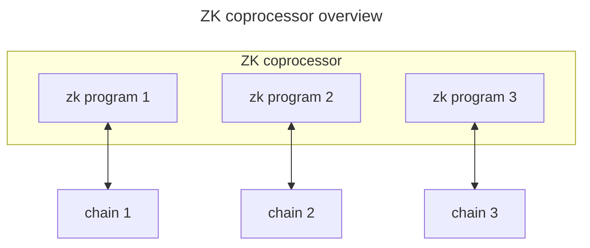
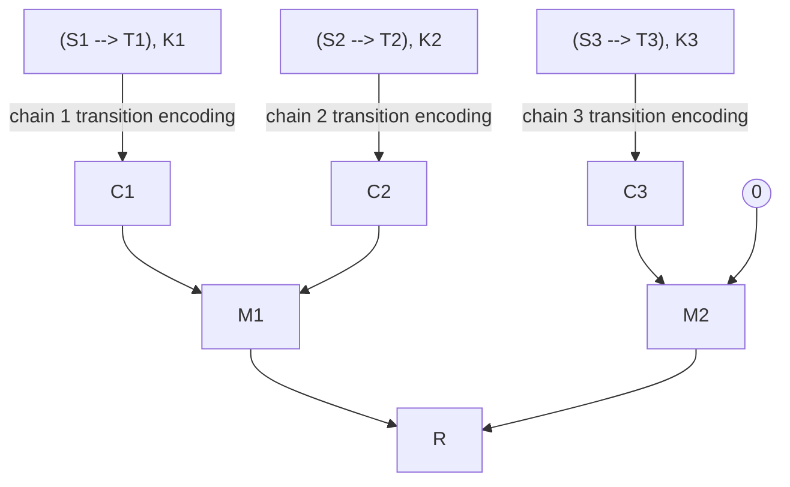
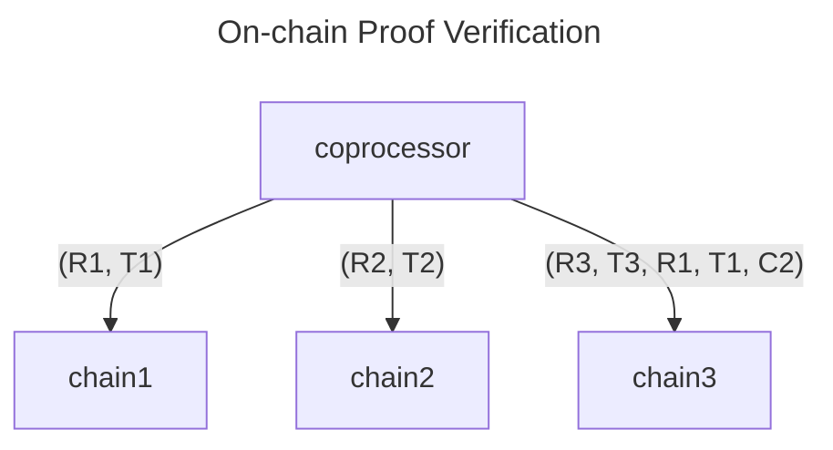

# Valence ZK coprocessor

> ⚠️ **Note:** Valence's ZK coprocessor is currently in specification stage and evolving rapidly. This document is shared to give partners a preview of our roadmap in the spirit of building in public.

The Valence ZK coprocessor is a universal DeFi execution engine. It allows developers to compose programs once and deploy them across multiple blockchains. Additionally, the coprocessor facilitates execution of arbitrary cross-chain messages with a focus on synchronizing state between domains. Using Valence, developers can:
1. Build once, deploy everywhere. Write programs in Rust and settle on one or more EVM, Wasm, Move, or SVM chains.
2. Avoid introducing additional trust assumptions. Only trust the consensus of the underlying chains you are building on.

While the actual execution is straightforward, *the challenge lies in encoding state*. The ZK program, as a pure function, must be able to to utilize existing state as arguments to produce an evaluated output state.

Initially, we can develop an efficient version of this coprocessor approximately at par with creating the state encoder. However, it is crucial to note that each chain will necessitate a separate encoder implementation. The initial version will necessitate users to deploy their custom verification keys along with the state mutation function within the target blockchain. Although the code required for this purpose will be minimal, users will still need to implement their own verification keys and state mutation functions.

Longer term, we plan to develop a decoder that will automate the state mutation process based on the output of the ZK commitment. For this initial version, users will be able to perform raw mutations directly, as the correctness of ZK proofs will ensure the validity of messages according to the implemented ZK circuit.



## zkVM Primer

A zero-knowledge virtual machine (zkVM) is a zero-knowledge proof system that allows developers to prove the execution of arbitrary programs. In our case these programs are written in Rust. Given a Rust program that can be described as a pure function`f(x) = y`, one can prove the evaluation in the following way:
1. Define `f` using normal Rust code and compile the function as an executable binary
2. With this executable binary, set up a proving key `pk` and verifying key `vk`
 3. Generate a proof `p` that `f` was evaluated correctly given input `x` using the zkVM, by calling `prove(pk, x)`
4. Now you can verify this proof `p` by calling `verify(vk, x, y, p)`

## Building the Valence ZK coprocessor

Let's assume that we have Valence Base Accounts in each domain. These accounts implement a kv store.

Every ZK computation will follow the format of a pure state transition function; specifically, we input a state `A`, apply the function `f` to it, and produce the resulting state `B` : `f(A) = B` .
For the function `f`, the chosen zkVM will generate a verifying key `K`, which remains consistent across all state transition functions.

### Encoding the account state: Unary Encoder

To ensure every state transition computed as a ZK proof by the coprocessor is a pure state transition function, we require a method to encode the entire account's state into initial and mutated forms, `A` and `B`, respectively, for use in providing the applicable state modifications for the target chain.

In essence, let's consider an account with its state containing a map that assigns a balance (u64 value) to each key. A contract execution transferring 100 tokens from key `m` to `n` can be achieved by invoking `state.transfer(signature, m, n, 100)`. This on-chain transfer function may look something like this:

```rust
fn transfer(&mut self, signature: Signature, from: Address, to: Address, value: u64) {
    assert!(signature.verify(&from));
    assert!(value > 0);

    let balance_from = self.get(&from).unwrap();
    let balance_to = self.get(&from).unwrap_or(0);

    let balance_from = balance_from.checked_sub(value).unwrap();
    let balance_to = balance_to.checked_add(value).unwrap();

    self.insert(from, balance_from);
    self.insert(to, balance_to);
}
```

Here, the pre-transfer state is `A` and after the transfer, the state is `B`.

Let's write a new function called `transfer_trusted` that leaves signature verification to the ZK coprocessor.

```rust
fn transfer_trusted(&mut self, from: Address, to: Address, value: u64) {
    let balance_from = self.get(&from).unwrap();
    let balance_to = self.get(&to).unwrap_or(0);

    self.insert(from, balance_from - value);
    self.insert(to, balance_to + value);
}
```

In the ZK setting, we execute the `transfer` function within the zkVM. We must input the encoded state the account and receive as output the encoded state of the mutated account.

```rust
fn program(mut state: State, encoder: Encoder, arguments: Arguments) -> Commitment {
    let (signature, from, to, value) = arguments;
    let initial = encoder.commitment(state);

    state.transfer(signature, from, to, value);

	let arguments = encoder.commitment(arugment)
    let finalized = encoder.commitment(state)
    let output = encoder.commitment(initial, arguments, finalized)

    encoder.commitment(initial, arguments, output)
}
```

Running this program within the zkVM, also allows us to generate a `Proof`.

Upon receiving the `(Proof, Commitment, Arguments)` data on the target chain, it can validate the execution correctness by verifying the proof and commitments, leveraging the ZK property that the proof will be valid if, and only if, the contract's execution was accurate for the given inputs, and the supplied commitments are those generated specifically for this proof.

```rust
fn verify(&self, proof: Proof, arguments: Arguments) {
    let current = self.state.commitment();
    let args = arguments.commitment();
    let (from, to, value) = arguments;

    self.transfer_trusted(from, to, value);

    let mutated = self.state.commitment();
    let commitment = (current, args, mutated).commitment();

    proof.verify(&self.vk, commitment);
}
```

By doing so, we switch from on-chain signature verification to computation over committed arguments, followed by ZK proof verification. Although we've presented a simplified example, the same verification process can accommodate any computation supported by a zkVM, enabling us to process multiple transfers in batches, perform intricate computation, and succinctly verify execution correctness. We refer to this pattern as a **"Unary Encoder"** because we compress the two states of the account, 'current' and 'mutated', into a single zero-knowledge proof.

The Unary Encoder will be the responsible for compressing any chain account state into a compatible commitment for the chosen zkVM (in our case a RISC-V zkVM). The encoding is a one-way function that allows anyone in possession of the pre-image, i.e. inputs to the encoding function, to reconstruct the commitment. This commitment will be transparent to the target chain, enabling use in construction of the block header for verification purposes.

### Handling state transition dependencies across domains: Merkelized Encoder

Lets assume a hypothetical situation where we aim to achieve decoupled state updates across three distinct chains: `chain 1`, `chain 2`, and `chain 3`. The objective is to generate a unified ZK proof that verifies the correctness of the state transitions on all chains.

Specifically, `chain 3` will depend on a mutation from `chain 1`, while `chain 2` operates independently of the mutations on both `chain 1` and `chain 3`.



The Merkle Graph above depicts the state transition that can be compressed into a single commitment via Merkelization. Given an encoder with a specialized argument—a Sparse Merkle tree containing encoded state transition values indexed by the program's view key on the target blockchain—we obtain a Merkle Root denoted as `R`.

The ZK coprocessor can execute proof computations either sequentially or in parallel. The parallel computation associated with `C2` operates independently and generates a unary proof of `S2 -> T2`. Conversely, the proof for `C3` requires querying `T1`.

Since `chain 3` has a sequential execution, the coprocessor will first process `C1`, then relay the pre-image of `T1` to the coprocessor responsible for computing `C3`. Due to the deterministic nature of unary encoding, the `chain 3` coprocessor can easily derive `T1` and validate its foreign state while concurrently processing `C3`.

At this point, there is no justification given for Merkelizing the produced proofs, hashing the entire set of Merkle arguments would work as well. However, it's worth noting that `chain 2` does not require knowledge of the data `(S1, T1, K1, S3, T3, K3)`. Including such information in the verification arguments of `chain 3` would unnecessarily burden its proving process. A Merkle tree is employed here for its logarithmic verification property: the condensed proof generated for `chain 2` will only require a Merkle opening to `R`, without requiring excess state data from other chains. Essentially, when generating the Merkelized proof, the `chain 2` coprocessor, after computing `C2`, will need only `C1` and `M2`, rather than all Merkle arguments.

Finally, each chain will receive `R`, accompanied by its individual state transition arguments, and the Merkle path leading to `R` will be proven inside of the circuit.



In this diagram we see `chain 3` will first `verify(R3, T3)`, then `verify(R1, T1)`, then it will `query(T1)`, then compute `C1 := encoding(S1, T1)`, then compute  `C3 := encoding(S3, T3)`, and finally will assert `R == H(H(C1, C2), H(C3, 0))`.
