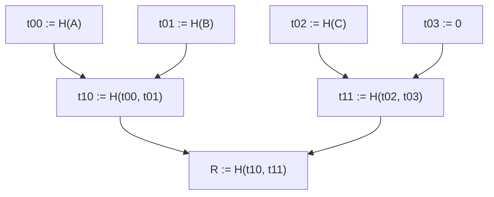
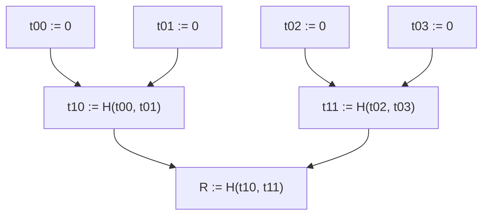
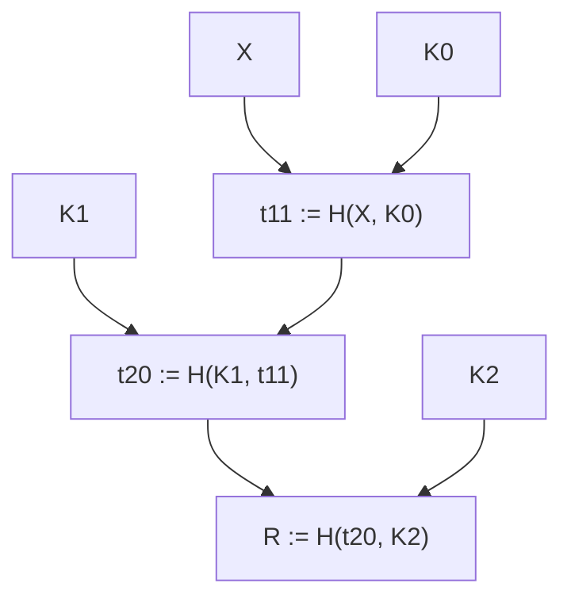

# Sparse Merkle Tree

A Sparse Merkle Tree (SMT) is a specialized version of a Merkle Tree, characterized by a leaf index defined by an injective function derived from a predefined argument at the design level. The verification key of a Zero-Knowledge (ZK) circuit is another constant, also injective to the circuit's definition, and can serve as an index for the available programs.

In the context of a ZK proof being a product of its verification key (alongside other attributes), it allows us to index a proof from a collection of proofs for distinct programs.

Assuming that we don't reuse the same proof for different purposes during a state transition, as the program will either be raw or recursed, the verifying key is an unique index in such collection.

This document describes a Sparse Merkle Tree design that employs indexing proofs based on the hash of the verification key.

## Merkle Tree

A Merkle Tree is typically a (binary) tree structure consisting of leaves and nodes. Each node in this tree represents the cryptographic hash of its children, while the leaves hold an arbitrary piece of data – usually the hash value of some variable input.

For a hash function `H`, if we insert the data items A, B, C into a Merkle Tree, the resulting structure would look like:

### Membership proof

A Merkle Tree serves as an efficient data structure for validating the membership of a leaf node within a set in logarithmic time, making it especially useful for handling large sets. A Merkle Opening (or Merkle Proof) represents an array of sibling nodes that outline a Merkle Path leading to a commitment Root. If the verifier possesses the root and employs a cryptographic hash function, the pre-image of the hash is non-malleable; in a cryptographic hash, it's unfeasible to discover a set of siblings resulting in the root, except for the valid inputs. Given that the leaf node is known to the verifier, a Merkle Proof will consist of a sequence of hashes leading up to the root. This allows the verifier to compute the root value and compare it with the known Merkle Root, thereby confirming the membership of any provided alleged member without relying on the trustworthiness of the source. Consequently, a single hash commitment ensures that any verifier can securely validate the membership of any proposed member supplied by an untrusted party.

On the example above, the Merkle Opening for `C` is the siblings of the path until the root, that is: `[t03, t10]` . The verifier, that knows `R` beforehand, will compute:

1. `t02 := H(C)` 
2. `t11 := H(t02, t03)`
3. `R' := H(t10, t11)` 

If `R == R'`, then `C` is a member of the set.

Note that the depth of the tree is the length of its Merkle Opening, that is: we open up to a node with depth equal to the length of the proof.

## Sparse Data

Let's consider a public function `f` that accepts a member and returns a tuple. This tuple consists of the index within the tree as a `u64` value, and the hash of the leaf: `(i, h) = f(X)`.

For the example above, let’s assume two members:

- `(3, a) := f(A)`
- `(1, b) := f(B)`

The primary distinction of a Sparse Merkle Tree lies in the deterministic leaf index, making it agnostic to input order. In essence, this structure forms an unordered set whose equivalence remains consistent irrespective of the sequence in which items are appended.

The behavior of the membership proof in this context mirrors that in a traditional Merkle Tree, except that a Sparse Merkle Tree enables the generation of a non-membership proof. To achieve this, we carry out a Merkle Opening at the specified target index, and expect it to be `0`.

Let’s assume a non-member `X` to be `(0, x) := f(X)` . To prove non-membership, we broadcast `[b, t11]` . To verify the non-membership of `X`, knowing `R` and the non-membership proof, we:

1. `(0, x) := f(X)`
2. `t10 := H(0, b)` ; here we open to `0` 
3. `R’ := H(t10, t11)`

If `R == R'` , then `0` is at the slot of `X` . Since we know `X` to not be the pre-image of `0` in `H`, then `X` is not a member of the tree. 

## Valence SMT

Within the scope of Valence, the Sparse Merkle Tree is designed to utilize the hash of the verifying key generated by the ZK circuit as its index. The tree's leaf data will encompass the proof and input arguments for the ZK program. In this particular implementation, we can consider the input arguments as a generic type, which will be specifically defined during development. These input arguments will constitute the key-value pairs that define a subset of the contract state essential for state transition. The proof will be a vector of bytes.

The tree depth will be adaptive, representing the smallest feasible value required to traverse from the leaf nodes up to the root, given the number of elements involved. This approach ensures we avoid unnecessary utilization of nodes containing unused entries.

For instance, if the tree contains two adjacent nodes indexed at `[(0,0), (0,1)]`, the Merkle Opening proof will have a single element - specifically, the sibling leaf of the validated node.

In case the tree comprises two nodes with indices `[(0,0), (0,2)]`, the Merkle Opening will require two elements, allowing for a complete traversal from the leaves to the root.

### Precomputed empty subtrees

Every Merkle Tree implementation should include a pre-computed set of empty subtrees, based on the selected hash primitive. To avoid unnecessary computational expenditure, it is more efficient to pre-compute the roots of subtrees consisting solely of zeroed leaves. For instance, all the nodes of the following Merkle Tree are constant values for `H` :

Let’s assume we have a long path on a Sparse Merkle Tree with a single leaf `X` with index 2:

It would be a waste to compute `(K0, K1, K2)` here as they are, respectively, `K0 := H(0)`, `K1 := H(K0, K0)`, `K2 := (K1, K1)`. In other words, they are constant values that should be available and should never have to hit the database backend in order to have their values fetched, nor should they exist as a data node. Whenever the tree queries for a node that doesn't exist on the data backend, it should return the constant precomputed empty subtree for that depth.

Normally, the trees will support precomputed values up to a certain depth. If we adopt a 16 bits output hash function, we should have 16 precomputed empty subtrees.

### Future upgrades

We don't expect the MVP to be optimized. That is: we should have a working implementation, but not tweaked to our use-case.

- **Hash**: In the context of Sparse Merkle Trees, the MVP could employ a widely-accepted cryptographic hash function as its fundamental building block. For example, the Keccak256, which is native to EVM, could be used due to its broad availability. However, utilizing this hash function may lead to an extensive gap between nodes, potentially resulting in a tree structure with only 2 leaves yet a significant depth, as the hashes of the two verifying keys might be exceptionally far apart. A future improvement would be to choose of a cryptographic hash that keeps the leaf nodes close. One cheap method to achieve this is by taking the initial `n` bits (e.g., 16) of the hash output and using it as an index, given that any secure cryptographic hash maintains its collision resistance and avalanche effect characteristics across the target security level with the selected number of sampled bits. While we anticipate not dealing with a large number of programs (i.e. a 256-bit number), 16 bits should be more than sufficient for this purpose.
- **Data backend**: In typical scenarios, the number of nodes in a proof batch shouldn't be large: 8 bits should suffice to represent the number of programs; for very complex and large batches, 16 bits should suffice. Choosing a Database Backend for a Merkle Tree can be challenging because it involves deciding on storage methodologies and optimizing database seek operations to retrieve nodes from the same path on a single page when possible. However, with a limited number of nodes, a streamlined database backend could suffice, delivering requested nodes without regard for the total page count. Given this performance constraint, we should prioritize compatibility over optimization: the ability to use the same backend across multiple blockchain clients and execution environments is more crucial than fine-tuning something that functions well only under specific conditions.