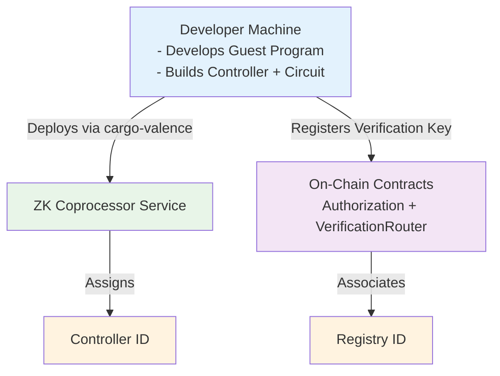
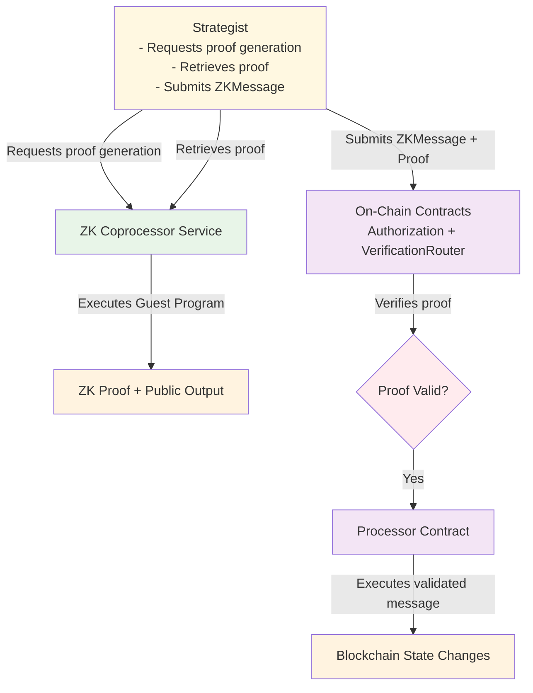

# Valence ZK System Overview

The Valence Zero-Knowledge (ZK) system facilitates the execution of complex or private computations off-chain, with their correctness verified on-chain through cryptographic proofs. This overview describes the primary components and the general flow of information and operations within this system. The foundational concepts of ZK proofs in Valence are introduced in [Introduction to Valence ZK](./_overview.md).

At its core, the system integrates an off-chain ZK Coprocessor Service with on-chain smart contracts, primarily the `Authorization` and `VerificationRouter` contracts. A key technical challenge is encoding blockchain state into formats suitable for zero-knowledge proofs, enabling pure functions to operate on committed state transitions. For detailed information on state encoding mechanisms and cross-chain coordination, see [State Encoding and Encoders](./07_state_encoding_and_encoders.md).

### Component Roles

The Valence ZK system comprises several key components, each with distinct responsibilities.

The **ZK Coprocessor Service**, operating off-chain, is a persistent service that manages ZK "guest programs." It deploys new guest programs, executes them with specific inputs, manages proving using an underlying zkVM (like SP1), and makes generated proofs available. Developers interact with this service to deploy ZK applications and initiate proof generation.

A **Guest Program** is application-specific code developed by users. It consists of two parts: the **Controller** (Wasm-compiled Rust code running in the Coprocessor's sandbox) takes input data, processes it to generate a "witness" for the ZK circuit, and coordinates proof generation. The **ZK Circuit** (e.g., SP1 circuit) performs the core computation and assertions, taking the witness and producing a proof and public output (`Vec<u8>`) that forms the primary data for on-chain contracts.

The **`Authorization` Contract** (e.g., `Authorization.sol` for EVM chains) serves as the entry point for submitting ZK proofs for verification. It handles ZK-specific authorization logic, checking if proof submitters are authorized for given ZK programs (by `registry` ID) and managing replay protection.

The **`VerificationRouter` Contract** performs actual cryptographic verification of ZK proofs. The `Authorization` contract stores the Verification Keys(VKs) and a route and delegates verification to a configured `VerificationRouter`, which stores a verifier address for each route and uses them to submit the proofs, public inputs and a payload to verify the proof.

### ZK Program Flows

The following diagrams illustrate the key workflows in the Valence ZK system:

#### Deployment Flow

Developers prepare and register their ZK applications, initializing the application before execution. They build guest program components, deploy them to the coprocessor service, and register verification keys on-chain.

#### Runtime Flow

Strategists execute ZK-proven actions on-chain through an operational process. They request proof generation from the coprocessor and then submit verified proofs to trigger on-chain execution.

### Operation

The process of executing an off-chain computation and verifying it on-chain generally follows a sequence of interconnected steps.

**Development and Deployment**

During development and deployment (off-chain), a developer creates a guest program, defining its Controller and ZK `circuit`. This guest program is compiled (Controller to Wasm, circuit to target representation) and deployed to the ZK Coprocessor service using `cargo-valence` CLI, which assigns a unique Controller ID. The Verification Key (VK) for the circuit is registered in an on-chain `Authorization.sol` contract and associated with a `registry` ID that the `Authorization` contract uses.

**Proof Request and Generation**

Proof request and generation (off-chain) is initiated when an off-chain entity requests the ZK Coprocessor service to execute the deployed guest program with specific input data using `cargo-valence` CLI. The Coprocessor runs the Controller, which generates the necessary witness for the ZK `circuit`. The `circuit` executes with this witness, and the Coprocessor generates the ZK proof and circuit's public output. The Controller may store this proof and output in its virtual filesystem.

**Proof Submission and Verification**

Following proof generation, the off-chain entity retrieves the ZK proof and circuit's public output from the Coprocessor. It constructs a `ZKMessage`, which includes the circuit's public output (forming the `processorMessage`), the `registry` ID, a `blockNumber` for replay protection, and the target `authorizationContract` address. This `ZKMessage` and ZK proof are submitted to the `executeZKMessage` function of the `Authorization` contract.

**On-Chain Processing**

This triggers on-chain processing. The `Authorization` contract performs initial checks, verifying sender authorization for the `registry` ID and ensuring replay protection using the `blockNumber`. If checks pass, it calls the `verify` function on the `VerificationRouter`, passing the ZK proof and public inputs. The `VerificationRouter` fetches the correct verifier from the route provided by the `Authorization` contract and delegates the proving to this verifier, passing the vk, proof, public inputs and a payload.

**Execution of Proven Action**

Upon successful proof verification, the `Authorization` contract considers the `ZKMessage` contents (specifically the `processorMessage`) authentic and authorized. It dispatches this `processorMessage` to the appropriate Valence `Processor` contract for execution, leading to blockchain state changes based on the ZK-proven off-chain computation.

This system allows Valence to securely integrate complex off-chain logic with its on-chain operations, opening up a wide range of advanced application possibilities. 