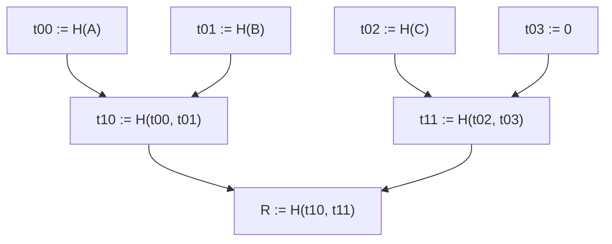
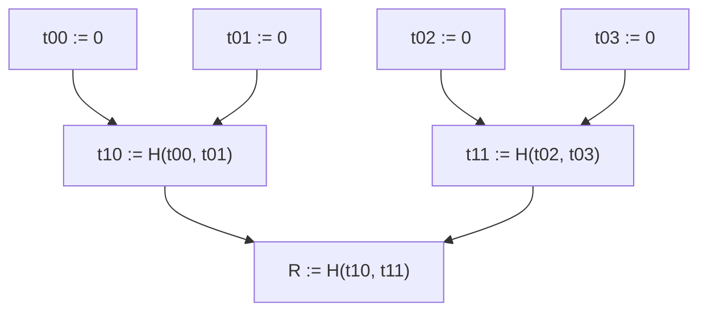
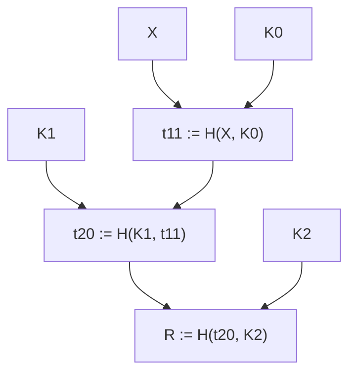

# Sparse Merkle Trees in Valence

A sparse Merkle tree (SMT) is a specialized Merkle tree with leaf indices defined by an injective function from predefined arguments. The verification key of a ZK circuit, being injective to the circuit's definition, serves as an index for available programs.

Since ZK proofs are uniquely tied to their verification keys, we can use these keys to index and organize proofs from different programs. This makes each verification key a unique identifier for its corresponding proof within the collection.

## Merkle Tree

A Merkle tree is an authenticated data structure consisting of leaves and nodes that form a tree shape. Each node in this tree represents the cryptographic hash of its children, while the leaves hold an arbitrary piece of data—usually the hash value of some variable input.

For a hash function `H`, if we insert data items A, B, C into a Merkle tree, the resulting structure would look like:

*Figure 1: Basic Merkle tree structure. The node labeling uses a coordinate system where the first digit represents the tree level (0 = leaves, 1 = intermediate nodes, etc.) and the second digit represents the position at that level. Each parent node is computed as the hash of its two children in this binary tree structure.*

### Membership Proof

A Merkle tree serves as an efficient data structure for validating the membership of a leaf node within a set in logarithmic time, making it especially useful for handling large sets and well-suited for random insertion patterns. A Merkle opening (or Merkle proof) represents an array of sibling nodes that outline a Merkle Path leading to a commitment Root. If the verifier possesses the root and employs a cryptographic hash function, the pre-image of the hash is non-malleable; in a cryptographic hash, it's unfeasible to discover a set of siblings resulting in the root, except for the valid inputs. Given that the leaf node is known to the verifier, a Merkle Proof will consist of a sequence of hashes leading up to the root. This allows the verifier to compute the root value and compare it with the known Merkle root, thereby confirming the membership of any provided alleged member without relying on the trustworthiness of the source. Consequently, a single hash commitment ensures that any verifier can securely validate the membership of any proposed member supplied by an untrusted party.

To prove that `C` is in the tree, the Merkle proof includes the sibling nodes along the path from `C` to the root: `[t03, t10]`. So the verifier, that knows `R` beforehand, will compute:

1. `t02 := H(C)`
2. `t11 := H(t02, t03)`
3. `R' := H(t10, t11)`

If `R == R'`, then `C` is a member of the set.

Note that the depth of the tree is the length of its Merkle opening, that is: we open up to a node with depth equal to the length of the proof.

## Sparse Data

Let's consider a public function `f` that accepts a member and returns a tuple. This tuple consists of the index within the tree as a `u64` value, and the hash of the leaf: `(i, h) = f(X)`.

For the example above, let's assume two members:

- `(3, a) := f(A)`
- `(1, b) := f(B)`

The primary distinction of a sparse Merkle tree lies in the deterministic leaf index, making it agnostic to input order. In essence, this structure forms an unordered set whose equivalence remains consistent irrespective of the sequence in which items are appended.

In addition to membership proofs sparse Merkle trees also support generating proofs of non-membership. To achieve this, we carry out a Merkle opening at the specified target index, and expect the returned value to be `0`.

Let's assume a non-member `X` to be `(0, x) := f(X)`. To verify that `X` is not in the tree, given the root `R` and the non-membership proof `[b, t11]`, the verifier:

1. Computes `(0, x) := f(X)` to find where `X` should be located (index 0)
2. Reconstructs `t10 := H(0, b)` using the empty slot (0) and sibling `b`
3. Computes the root `R' := H(t10, t11)` and checks if `R' == R`

If `R == R'`, then `0` is at the slot of `X`. Since we know `X` to not be the pre-image of `0` in `H`, then `X` is not a member of the tree.

## The Valence SMT

Valence's sparse Merkle tree is designed to utilize the hash of the verifying key generated by the ZK circuit as its index. The tree's leaf data will encompass the proof and input arguments for the ZK program. For this particular implementation, we can consider the input arguments as a generic type, which will be specifically defined during development. These input arguments will constitute the key-value pairs that define a subset of the contract state essential for state transition. The proof will be a vector of bytes.

The tree depth is adaptive, representing the smallest value required to traverse from a leaf node to the root, given the number of elements involved. This approach avoids writing nodes that contain unused entries. So if a tree contains two adjacent nodes indexed at `[(0,0), (0,1)]`, the Merkle opening will contain a single element: the sibling leaf of the validated node.

If the tree comprises two nodes with indices `[(0,0), (0,2)]`, the Merkle opening will have two elements, allowing for a complete traversal from the leaves to the root.

### Precomputed Empty Subtrees

The Valence SMT implementation includes a precomputed set of empty subtrees based on the selected hash primitive. For example, when a tree contains only empty nodes, all hash values are constant:

In practice, sparse Merkle trees often have many empty positions, especially when the index space is large but only a few positions are occupied. This creates opportunities for optimization through precomputation.

Consider a more realistic scenario where we have a sparse tree with a single leaf `X` at index 2:

Rather than computing `(K0, K1, K2)` each time, these values can be precomputed since they represent known constants: `K0 := H(0)`, `K1 := H(K0, K0)`, `K2 := H(K1, K1)`.

By using SMTs, Valence can efficiently manage and verify large collections of authenticated data, including ZK proofs from coprocessor applications and commitments to program states.