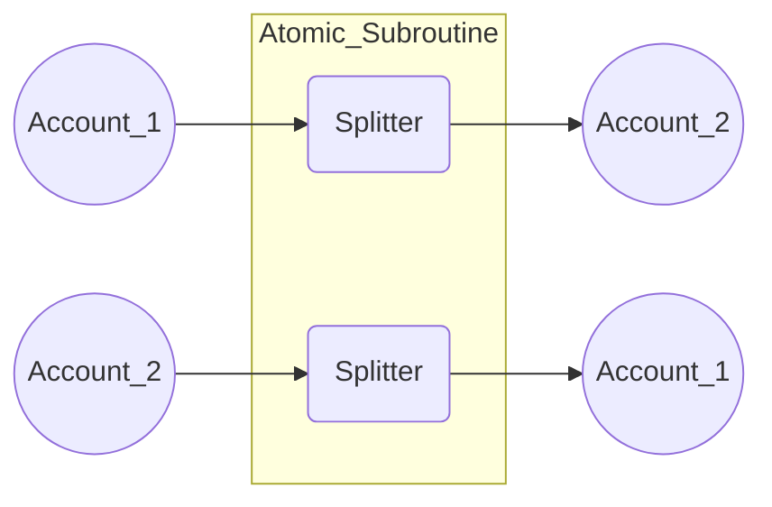
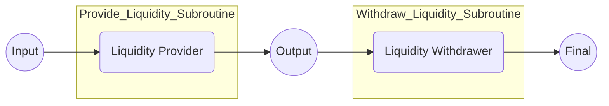

# Valence Program examples

This directory contains a set of simple Valence Programs meant to provide an overview of the Valence Protocol in action.

Each example program comes with an accompanying test file that demonstrates the program behavior. The tests spin up one or more local chains using the utilities provided in the [e2e](../e2e) directory. If you wish to start developing your own Valence Programs, it is recommended to first
build familiarity with the contents of that directory.

## Available examples

### Token Swap

The [token swap program](token_swap/src/token_swap.rs) demonstrates an atomic swap between two program controlled accounts. It also demonstrates:
* **Use of the [splitter](../contracts/libraries/splitter/) library.** This library can be configured to send tokens from 1 to many accounts. In the token swap example, the splitter library is used to send a fixed amount of tokens from the first account to the second and the second to the first.
* **Atomicity.** In this example the two function calls (send from one account to the other account and vice versa), are wrapped in an atomic subroutine.
* **Permissioning.** The atomic subroutine is configured so that it can be invoked by an authorized party. This authorized party is minted an authority token that assigns them the right to invoke the subroutine. The program could be written to permission the invocation of the subroutine differently (e.g., permissionless or permissioned with additional call constraints).



In the [test file](token_swap/src/token_swap_test.rs), the Neutron chain is setup and the program is configured and deployed. Then the two accounts are funded. Finally an authorized party invokes the subroutine to execute the swap. The final balances are asserted to be correctly swapped.

### Osmosis Concentrated Liquidity Provisioning

The [Osmosis CL](osmo_cl/src/osmo_cl.rs) program demonstrates creation of a liquidity position on Osmosis that is held in a program controlled account. The liquidity from this position can can be then withdrawn at a later date by invoking a subroutine. It also demonstrates:
* **Use of the Osmosis Concentrated [LPer](../contracts/libraries/osmosis-cl-lper/README.md) and [Withdrawer](../contracts/libraries/osmosis-cl-withdrawer/README.md) libraries**. These libraries can be configured to provide and withdraw liquidity to concentrated liquidity pools on Osmosis.
* **Invocation and execution on separate chains**. The subroutines to provide and withdraw liquidity are invoked on Neutron while the concentrated liquidity position is held on Osmosis.

This program can be extended to add additional subroutines, for example, to permissionlessly rebalance the liquidity in the position, or to send the withdrawn tokens to a different chain.



In the [test file](osmo_cl/src/osmo_cl_test.rs), the Neutron and Osmosis chains are first configured with a transfer channel between them. Contracts for Polytone (a message passing protocol over IBC) are initialized; Polytone is used by Valence Programs to send messages between domains that support IBC and CosmWasm. The Osmosis pool is configured. The input account is funded with OSMO tokens and NTRN tokens that are transferred from the Neutron chain.

The Provide Liquidity subroutine is invoked on Neutron and following this, the test asserts that the concentrated liquidity position is created. Then the Withdraw Liquidity subroutine is invoked and the test asserts that the final account holds the balance of the withdrawn liquidity.

## Running the examples locally

Testing environment needs to be set up in order to run the examples locally on your machine.

See the [e2e README](../e2e/README.md) for instructions on how that can be done.

Once `local-ic` is available in your path and is running the correct set of nodes, examples can be executed by running `just run-example <example>`.

For instance, in order to run the `token-swap-example` Program, execute the following:

```just
just run-example token-swap-example
```