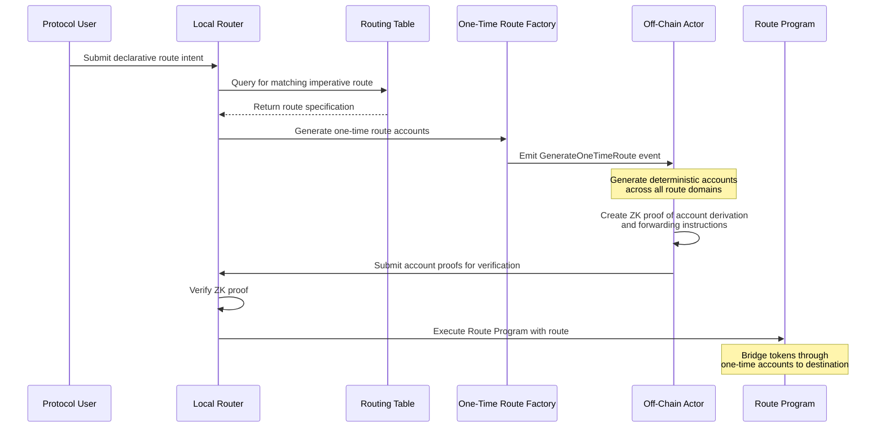

# Babylon Proposal Declarative Token Router for Cross-chain Reward Management

This document proposes a system for simply and securely moving tokens between blockchain networks. By abstracting over bridge protocols and execution environments, the proposed Declarative Router will allow Babylon and BSNs to specify their desired for cross-chain token deployment without dealing with the complex underlying mechanics of cross-chain routing. This flexible program can also serve as a secure foundation for progressively building out Babylon's sophisticated cross-chain reward distribution system.

## Background on Valence

Valence Protocol is a unified environment for building trust-minimised cross-chain DeFi applications, called Valence Programs. By abstracting over heterogeneous domains and bridge protocols, Valence enables developers to query and update state on multiple chains and orchestrate distributed control logic within a single logical program.

Valence Programs for common workflows can be created using a simple configuration template—or developers can write completely custom programs, leveraging existing libraries to accelerate development.

Valence provides a cross-chain account and authorization system, a processor for local execution. These core contracts provide the basic machinery for managing user interactions, enforcing permissions, handling message execution, batching, retries, and callbacks. From there, an extensible library pattern, allows for integration with external DeFi protocols, or third party contracts.

Valence supports on-chain execution, as well as off-chain excution via specialized ZK Coprocessor. CosmWasm and EVM target environments are available today, with plans for SVM and MoveVM in the coming months. Libraries tailored to each environment facilitate seamless integration with a diversity DeFi protocols and bridges.

Valence provides a Zero-Knowledge Coprocessor system to significantly enhance its capabilities and abstract complex computations from the on-chain layer. The off-chain Coprocessor system runs guest applications within a zkVM and generates cryptographic proofs verifying execution correctness. By offloading intensive tasks and only verifying succinct proofs on-chain, ZK applications increase throughput, and enable more complex cross-chain logic. A common RISC-V compilation target lets developers work in rust, write once and deploy anywhere.

This hybrid architecture combines the trust-minimisation of on-chain verification with the scalability and flexibility of off-chain computation, allowing developers to leverage the strengths of both to create more powerful and efficient cross-chain programs. Valence's flexibility and ease of use enable rapid development and iteration of cross-chain protocols, while its trust minimization makes it essential for building robust cross-chain protocols.

## Problem Statement

Recently Babylon begin experimenting with BSN reward distribution by issuing $BABY token grants to two networks, BOB, and Corn. However, this process required coordinating a trusted custodian to transport the funds cross-chain, and delivered transported there is no way to incorporate information about dispersal back into the Babylon system.

Additionally, Babylon's core economic model relies on transporting staking yield issued on BSN chains back to the main chain for redistribution. The ability to programmatically distribute assets across multiple blockchains is essential for Babylon's core operations, enabling the incentivization of liquidity, user pay-outs, and more sophisticated cross-chain strategies.

Reliably moving assets among a heterogeneous network of networks in a trust-minimized fashion requires interaction with a variety of execution environments and bridge protocols, managing many fee tokens, and handling failover in the event of a network outage. Cross-chain token movement is complicated by the fact that bridges are issuers. Tokens on a destination chain are often not native to that chain but are minted representations issued by a bridge protocol. This implies that selecting a bridge is an implicit part of specifying the token's *form* on the destination chain.

The mechanics of cross-chain token movement, bridge selection, token denom mapping, paying fees on intermediate chains, constitute substantial complexity that's difficult to encapsulate and reuse without a structured abstraction layer. Instead, we propose creating a  declarative routing system: one where the intent to move tokens is expressed cleanly, and the underlying routing, bridging, and intermediate account management is handled automatically.

## Design Goals

* **Bridge abstraction**: cleanly decouple business logic from route selection.
* **Correct denomination**: ensure tokens arrive in their expected form on the destination chain.
* **Declarative interface**: allow protocols to specify *what* they want, not *how* to do it.
* **Cross-chain support**: operate across Cosmos, Ethereum Main chain,  Ethereum L2s, extensible to chains like Sui and others in the future.
* **Multi-bridge composition**: support multiple bridging protocols (IBC, IBC Eureka, Union, Canonical OP Stack L2 bridge, Canonical Arbitrum L2 bridge, LayerZero) and compose them into heterogeneous multi-hop routes.
* **Forward compatibility**: Extension points for building an advanced cross-chain BSN reward system.

## Architecture Overview

This system operates on two key concepts:

**Declarative Routes**: Protocol users specify only the desired outcome. They say what token they have on the origin chain, and what token they want on the destination chain.

**Imperative Routes**: The system matches declarative route "intents," with specific execution paths. This includes assigning intermediate accounts to instantiate and use, selecting bridges to route through, and assigning forwarding operations.

> **Note on Intents**: The declarative routing described here implements an "intent" system, however these intents are processed via smart contract or ZK circuit, rather than via capitalized market maker. This avoids the capital efficiency issues typically associated with off-chain intent systems, where market makers must pre-position capital across many chains. Off-chain intents with market maker fulfillment could be implemented as a future enhancement, allowing protocols to choose between latency (off-chain) and capital efficiency (on-chain) trade-offs.

## Protocol Interface

### Declarative Route

Protocols interact with the system by submitting a declarative route, specifying only the desired outcome:

```json
{
  "origin": {
    "token": "ETH",
    "domain": "Ethereum"
  },
  "destination": {
    "token": "USDC",
    "domain": "Osmosis"
  },
  "amount": "1000000000000000000",
  "recipient": "osmo1xyz...",
  "constraints": {
    "maxSlippageBps": 50,
    "expiresAt": 12345678
  }
}
```

The router matches this against the Routing Table to identify a valid imperative route. If a match is found, the route can be executed or scheduled for execution. If no route exists, the system may queue the request until the next Routing Table update or fast-settlement fill opportunity.

### Routing Process

* Protocols deposit funds into the origin account and send a declarative intent to a **Local Router**.
* Each intent specifies the source token, destination chain, destination denom, and amount (plus constraints on execution).
* The router queries a **Routing Table** to determine the correct route.
* A Route Program is then executed, bridging tokens via one or more hops, delivering them to the correct account on the destination.

### System Flow



## System Components

### Routing Table

The Routing Table is the canonical index of valid token movement pathways. It maps declarative intents to specific imperative routes and is periodically regenerated and published via ZK proof to ensure correctness and non-manipulability.

> **Note:** A ZK proof is used instead of a simple Merkle proof because it not only proves inclusion of the routing entry but also validates that each route was correctly constructed. The ZK circuit enforces rules about valid bridge sequences, deterministic address derivation, token form transformations, and domain capabilities—ensuring trust-minimized off-chain computation of routing logic.

Each entry in the Routing Table is structured as follows:

```json
{
  "origin": {
    "token": "ETH",
    "domain": "Ethereum"
  },
  "destination": {
    "token": "USDC",
    "domain": "Osmosis"
  },
  "path": [
    {
      "domain": "Polygon",
      "bridge": "CanonicalOPBridge"
    },
    {
      "domain": "Osmosis",
      "bridge": "IBC"
    }
  ],
  "expectedTokenForm": "USDC",
  "constraints": {
    "expiresAt": 12350000,
    "maxSlippageBps": 30
  }
}
```

### Account System

Each route spans several domains and requires:

* An account on the origin chain to initiate the transfer.
* One or more intermediate accounts to handle forwarding.
* An account on the destination that receives the bridged token, and enabling an authorized post-route action.

Efficient deployment and management of cross-chain accounts is critical, requiring deterministic, scalable account instantiation. Off-chain account generation introduces concerns like front-running and replay attacks. These risks are mitigated through careful entropy selection, enforcing one-time use, hardening controller linkage, and verifying address derivations within the ZK coprocessor.

Theoretically one could design a system with account reuse, however one-time accounts were chosen to avoid the complexity of distributed garbage collection.

## Implementation Details

### One-Time Route Factory

To enable dynamic routing, we introduce a factory mechanism that supports the generation of one-time accounts per-route. This begins with a dedicated entry point contract deployed on the origin chain. Protocols interact with this contract by submitting a `GenerateOneTimeRoute` message, which includes:

```json
{
  "token": {
    "denom": "ETH",
    "originDomain": "Ethereum"
  },
  "path": [
    {
      "domain": "Polygon",
      "bridge": "CanonicalOPBridge"
    },
    {
      "domain": "Osmosis",
      "bridge": "IBC"
    }
  ]
}
```

> **Note:** We do not expect protocol users to interact with this imperative routing mechanism directly. Instead, they submit a declarative intent, which is used to look up the coorosponding imperative route in the Routing Table. This matching step confirms that the generated route satisfies the desired token transformation from origin to destination.

### Route Creation Process

1. The block hash of the block containing the `GenerateOneTimeRoute` message is used as part of the entropy for deterministic account derivation.

2. Off-Chain Actors observe this message and generate the required accounts across all specified domains using the block hash, salt inputs, and factory logic.

3. These addresses are then proven inside a ZK coprocessor, which ensures that the derived addresses match the originating message and derivation rules.

4. Each account is instantiated with a set of forwarding instructions that constrain it to:
   * Forward only the designated token,
   * Use the expected bridge contract,
   * Target the correct destination address with a specific amount.

5. Off-Chain Actors produce a state proof bundle showing the existence of all required accounts and their attached forwarding rules.

6. These proofs are bundled with with address derivation proofs and submitted to the origin chain for verification.

7. Upon successful verification, the route is registered and becomes available exclusively to fulfill the original `GenerateOneTimeRoute` request.

## Cross-Chain Route Initiation

The declarative routing system can be extended to support initiating routes from remote chains. Consider a protocol on chain A that wants to move tokens from chain B to chain C (or back to chain A).

This cross-chain initiation can be achieved through the following approach:

1. The protocol on chain A creates an interchain account on chain B which can receive execution instructions from the protocol on chain A.
2. The protocol on chain A then sends a cross-chain message to its interchain account on chain B.
3. The interchain account on chain B submits a declarative route request to the Local Router on chain B.
4. The routing system on chain B processes this request normally, generating the necessary accounts and executing the route from chain B to the final destination.

### Gateway Enhancement

For convenience, the Local Router on chain A can be extended to act as a **gateway** for remote routing requests:

```json
{
  "remoteOrigin": {
    "token": "USDC",
    "domain": "Polygon"
  },
  "destination": {
    "token": "USDC", 
    "domain": "Osmosis"
  },
  "amount": "1000000000000000000",
  "recipient": "osmo1xyz...",
  "constraints": {
    "maxSlippageBps": 50,
    "expiresAt": 12345678
  }
}
```

When the Local Router on chain A receives such a request, it:

1. Identifies that the origin is a remote chain (Polygon, not chain A)
2. Routes the request through the protocol's interchain account on Polygon
3. The interchain account on Polygon then initiates the declarative route locally

This gateway approach provides a unified interface for protocols to initiate both local and remote routes from a single entry point, simplifying the developer experience while leveraging the full power of the declarative routing system across multiple chains.

## Implementing Cross-chain BSN Rewards using the Declarative Router

The Declarative Token Router offers a secure framework for progressively implementing BSN reward schemes, first tackling the complexity of cross-chain token movement for reward distribution and withdrawal.

An initial design could start from with granular token transfers (effectively an enhanced version of Design 2) by leveraging declarative routing, in conjunction with a final dispersal circuit.

As the protocol evolves, the same declarative framework can integrate more complex logic, including interaction with a gauge-based smart contract system by writing a simple library that translates gauge weights to cross-chain route declarations. The gauge model itself is already declarative, making this a very straightforward upgrade.

Valence's extensible library pattern allows for the development of additional modules to interact with the BSN's reward contract, oracles for fetching necessary data like exchange rates for APR calculations, or cross-chain queries to incorporate information about BSN state into the reward calculation.

Additionally, because Babylon will have both a CosmWasm and EVM chain, the availability of Valence's coprocessor makes any reward calculation or query logic completely portable if there is ever a desire to publish gague state from one chain to the other, or migrate the reward application altogether.

## Other Potential Extension Points

- Pendle-like principle/yield token market that is natively cross-chain.
- Auto-rebalancing Vault for highest cross-chain risk-adjusted returns.
- Incorporation of cross-chain state into Babylon reward calculation or accountability mechanism.