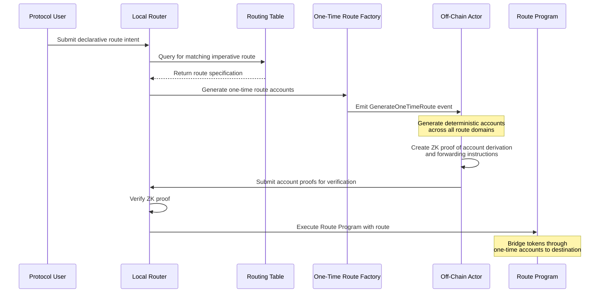

# Declarative Token Router: Design Document

## Problem Statement

Protocols often need to distribute assets across multiple blockchain domains as part of their core operations: incentivizing liquidity, paying out users, or coordinating cross-chain strategies. The complexity arises not in deciding which tokens should go where and in what amounts, but in actually moving those tokens reliably across chains.

Cross-chain token movement is complicated by the fact that bridges are issuers. Tokens on a destination chain are often not native to that chain but are minted representations issued by a bridge protocol. This implies that selecting a bridge is an implicit part of specifying the token's *form* on the destination chain.

The mechanics of cross-chain token movement, bridge selection, token denom mapping, paying fees on intermediate chains, constitute substantial complexity that's difficult to encapsulate and reuse without a structured abstraction layer. Instead, we propose creating a  declarative routing system: one where the intent to move tokens is expressed cleanly, and the underlying routing, bridging, and intermediate account management is handled automatically.

## Design Goals

* **Bridge abstraction**: cleanly decouple business logic from route selection.
* **Correct denomination**: ensure tokens arrive in their expected form on the destination chain.
* **Declarative interface**: allow protocols to specify *what* they want, not *how* to do it.
* **Cross-chain support**: operate across Cosmos, Ethereum Main chain,  Ethereum L2s, extensible to chains like Sui and others in the future.
* **Multi-bridge composition**: support multiple bridging protocols (IBC, IBC Eureka, Union, Canonical OP Stack L2 bridge, Canonical Arbitrum L2 bridge, LayerZero) and compose them into heterogeneous multi-hop routes.
* **Forward-compatible routing logic**: support future addition of fast settlement system.

## Architecture Overview

This system operates on two key concepts:

**Declarative Routes**: Protocol users specify only the desired outcome. They say what token they have on the origin chain, and what token they want on the destination chain.

**Imperative Routes**: The system matches declarative route "intents," with specific execution paths. This includes assigning intermediate accounts to instantiate and use, selecting bridges to route through, and assigning forwarding operations.

> **Note on Intents**: The declarative routing described here implements an "intent" system, but these intents are processed on-chain rather than off-chain. This avoids the capital efficiency issues typically associated with off-chain intent systems, where market makers must pre-position capital across many chains. Off-chain intents with market maker fulfillment could be implemented as a future enhancement, allowing protocols to choose between latency (off-chain) and capital efficiency (on-chain) trade-offs.

## Protocol Interface

### Declarative Route Structure

Protocols interact with the system by submitting a declarative route, specifying only the desired outcome:

```json
{
  "origin": {
    "token": "ETH",
    "domain": "Ethereum"
  },
  "destination": {
    "token": "USDC",
    "domain": "Osmosis"
  },
  "amount": "1000000000000000000",
  "recipient": "osmo1xyz...",
  "constraints": {
    "maxSlippageBps": 50,
    "expiresAt": 12345678
  }
}
```

The router matches this against the Routing Table to identify a valid imperative route. If a match is found, the route can be executed or scheduled for execution. If no route exists, the system may queue the request until the next Routing Table update or fast-settlement fill opportunity.

### Manual Routing Process

* Protocols deposit funds into the origin account and send a declarative intent to a **Local Router**.
* Each intent specifies the source token, destination chain, destination denom, and amount (plus constraints on execution).
* The router queries a **Routing Table** to determine the correct route.
* A Route Program is then executed, bridging tokens via one or more hops, delivering them to the correct account on the destination.

### System Flow



## System Components

### Routing Table

The Routing Table is the canonical index of valid token movement pathways. It maps declarative intents to specific imperative routes and is periodically regenerated and published via ZK proof to ensure correctness and non-manipulability.

> **Note:** A ZK proof is used instead of a simple Merkle proof because it not only proves inclusion of the routing entry but also validates that each route was correctly constructed. The ZK circuit enforces rules about valid bridge sequences, deterministic address derivation, token form transformations, and domain capabilities—ensuring trust-minimized off-chain computation of routing logic.

Each entry in the Routing Table is structured as follows:

```json
{
  "origin": {
    "token": "ETH",
    "domain": "Ethereum"
  },
  "destination": {
    "token": "USDC",
    "domain": "Osmosis"
  },
  "path": [
    {
      "domain": "Polygon",
      "bridge": "CanonicalOPBridge"
    },
    {
      "domain": "Osmosis",
      "bridge": "IBC"
    }
  ],
  "expectedTokenForm": "USDC",
  "constraints": {
    "expiresAt": 12350000,
    "maxSlippageBps": 30
  }
}
```

### Account System

#### Account Topology Per Route

Each route spans several domains and requires:

* An account on the origin chain to initiate the transfer.
* One or more intermediate accounts to handle forwarding.
* An account on the destination that receives the bridged token, and enabling an authorized post-route action.

#### Valence Account System Revision


#### Account Generation

Efficient deployment and management of cross-chain accounts is critical, requiring deterministic, scalable account instantiation, tailored to each environment:

* **EVM Minimal-Proxy Clones**: A single implementation contract is deployed along with a factory. The factory uses `CREATE2` with a numeric salt to mint deterministic wallet addresses that delegate-call back to the shared logic. Each clone costs approximately 13,000 gas to create, yet behaves as a full contract whose control logic can be passed via immutable arguments or an `initialize` call.

* **CosmWasm Instantiate2 Wallets**: A single wallet WASM is uploaded, then used to instantiate new contracts using `MsgInstantiateContract2`, with a numeric salt to derive predictable addresses off-chain. Each instance stores a controller address in state and forwards execution via `WasmMsg::Execute`. While instantiation costs are higher (~120,000–180,000 gas), these wallets avoid runtime overhead like EVM's `DELEGATECALL`.


The account generation techniques described above differ from the current Valence `BaseAccount` and `InterchainAccount` implementations on both EVM and CosmWasm. Specifically, these new approaches rely on deterministic instantiation using `CREATE2` (EVM) and `MsgInstantiateContract2` (CosmWasm) with a shared logic template, allowing for lightweight deployment and predictable addressing.

This means the existing account system will need to be revised to:

* Support controller-bound, instantiable wallets with upgradeable routing.
* Enable deterministic address derivation from numeric salts.
* Ensure consistent behavior across chains despite differences in delegation mechanics (`DELEGATECALL` vs. `WasmMsg::Execute`).

#### Security Considerations

Off-chain generation of deterministic wallet addresses introduces several important security concerns:

* **Front-running & Address Predeployment**: Predictable salts could allow malicious actors to pre-deploy contracts at expected addresses, disrupting intent resolution or hijacking control.
  * *Mitigation*: Use salts derived from domain-specific entropy, including the latest block hash of the origin domain, the intent hash, and a unique program ID. While the block hash is imperfect, it adds sufficient noise for most short-lived commitment windows.

* **Controller Binding**: Instantiated wallets must reliably bind to the intended controller without ambiguity or race conditions.
  * *Mitigation*: Use immutable args (EVM) or explicit `instantiate`-time state assignment (CosmWasm) to harden this linkage.

* **Replay or Reuse of Wallets**: Reusing salts across time or domains without careful versioning may expose the system to unintended side effects or misuse of old wallet instances.
  * *Mitigation*: Enforce strict one-time-use semantics for each generated account, with lifecycle tracking enforced by the Valence program.

* **ZK Routing Table Integrity**: Since account addresses depend on off-chain address generation, the Routing Table becomes a trust boundary.
  * *Mitigation*: Validate routes and the deterministic derivation of program-controlled account addresses inside the ZK coprocessor, ensuring consistency with the route specification and deployment logic.
  * *Note*: Even though the salt is provided off-chain as a witness to the ZK coprocessor, computing the address derivation inside the ZK proof ensures that the derived address is correct and consistent with program logic. This guards against manipulation or mismatch between declared and actual accounts, while allowing Off-Chain Actors to supply necessary entropy inputs.

To mitigate these concerns we opt for one-time-use, verifiably-controlled wallet creation and emphasize careful entropy/salt selection and validation logic.

## Implementation Details

### One-Time Route Factory

To enable dynamic routing, we introduce a factory mechanism that supports the generation of one-time accounts per-route. This begins with a dedicated entry point contract deployed on the origin chain. Protocols interact with this contract by submitting a `GenerateOneTimeRoute` message, which includes:

```json
{
  "token": {
    "denom": "ETH",
    "originDomain": "Ethereum"
  },
  "path": [
    {
      "domain": "Polygon",
      "bridge": "CanonicalOPBridge"
    },
    {
      "domain": "Osmosis",
      "bridge": "IBC"
    }
  ]
}
```

We do not expect protocol users to interact with this imperative routing mechanism directly. Instead, they submit a declarative intent, which is used to look up the coorosponding imperative route in the Routing Table. This matching step confirms that the generated route satisfies the desired token transformation from origin to destination.

### Route Creation Process

1. The block hash of the block containing the `GenerateOneTimeRoute` message is used as part of the entropy for deterministic account derivation.

2. Off-Chain Actors observe this message and generate the required accounts across all specified domains using the block hash, salt inputs, and factory logic.

3. These addresses are then proven inside a ZK coprocessor, which ensures that the derived addresses match the originating message and derivation rules.

4. Each account is instantiated with a set of forwarding instructions that constrain it to:
   * Forward only the designated token,
   * Use the expected bridge contract,
   * Target the correct destination address with a specific amount.

5. Off-Chain Actors produce a state proof bundle showing the existence of all required accounts and their attached forwarding rules.

6. These proofs are bundled with with address derivation proofs and submitted to the origin chain for verification.

7. Upon successful verification, the route is registered and becomes available exclusively to fulfill the original `GenerateOneTimeRoute` request.

## Cross-Chain Route Initiation

The declarative routing system can be extended to support initiating routes from remote chains. Consider a protocol on chain A that wants to move tokens from chain B to chain C (or back to chain A).

This cross-chain initiation can be achieved through the following approach:

1. The protocol on chain A creates an interchain account on chain B which can receive execution instructions from the protocol on chain A.
2. The protocol on chain A then sends a cross-chain message to its interchain account on chain B.
3. The interchain account on chain B submits a declarative route request to the Local Router on chain B.
4. The routing system on chain B processes this request normally, generating the necessary accounts and executing the route from chain B to the final destination.

### Gateway Enhancement

For convenience, the Local Router on chain A can be extended to act as a **gateway** for remote routing requests:

```json
{
  "remoteOrigin": {
    "token": "USDC",
    "domain": "Polygon"
  },
  "destination": {
    "token": "USDC", 
    "domain": "Osmosis"
  },
  "amount": "1000000000000000000",
  "recipient": "osmo1xyz...",
  "constraints": {
    "maxSlippageBps": 50,
    "expiresAt": 12345678
  }
}
```

When the Local Router on chain A receives such a request, it:

1. Identifies that the origin is a remote chain (Polygon, not chain A)
2. Routes the request through the protocol's interchain account on Polygon
3. The interchain account on Polygon then initiates the declarative route locally

This gateway approach provides a unified interface for protocols to initiate both local and remote routes from a single entry point, simplifying the developer experience while leveraging the full power of the declarative routing system across multiple chains.

## Future Work: Fast Settlement

The architecture supports the addition of a fast settlement mechanism enabling off-chain market makers to fulfill cross-chain intents proactively. In this enhanced system, users would include a stop-loss threshold in their intents, allowing a solver to elect to fill the order directly.

Orders are committed temporarily to the solver to avoid double fills. If an order is not filled within a specified timeout, it automatically reverts to the on-chain routing scheme described above. This approach introduces a latency versus capital efficiency trade-off, where protocols can choose between faster settlement via solvers, or more capital-efficient routing, via bridges.

This upgrade path maintains the declarative interface while adding an optional fast-path layer, ensuring minimal disruption to the core architecture and existing protocol integrations.
